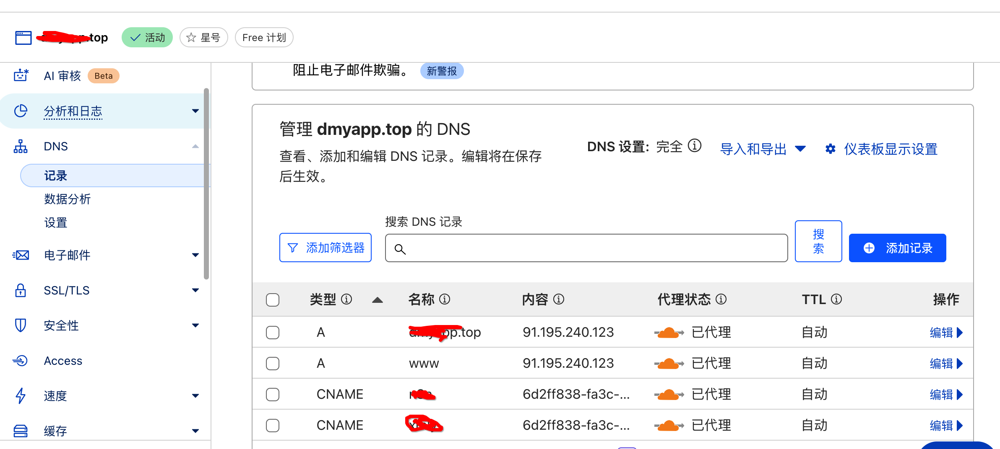
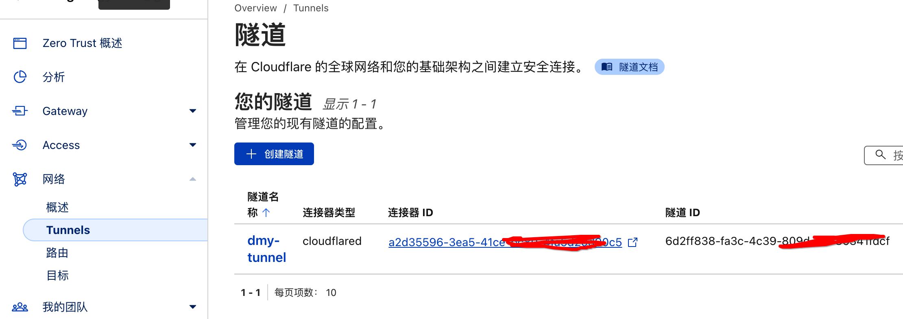
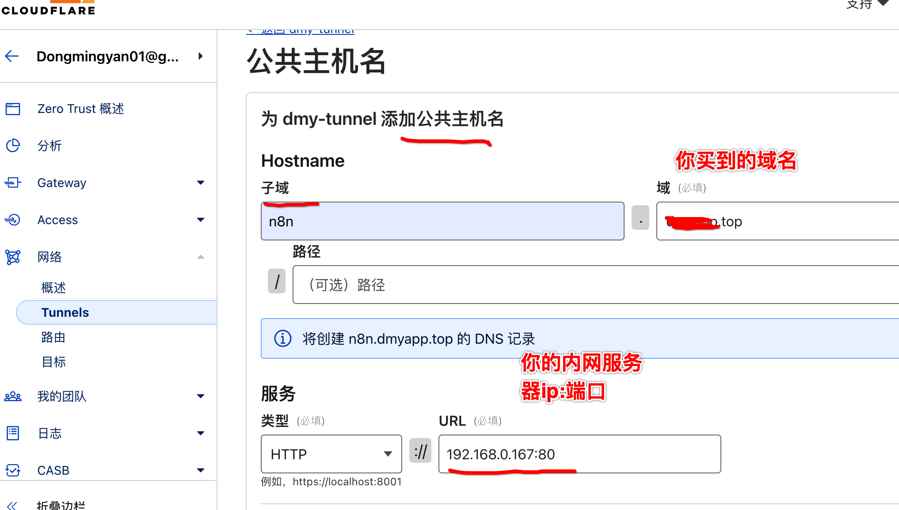
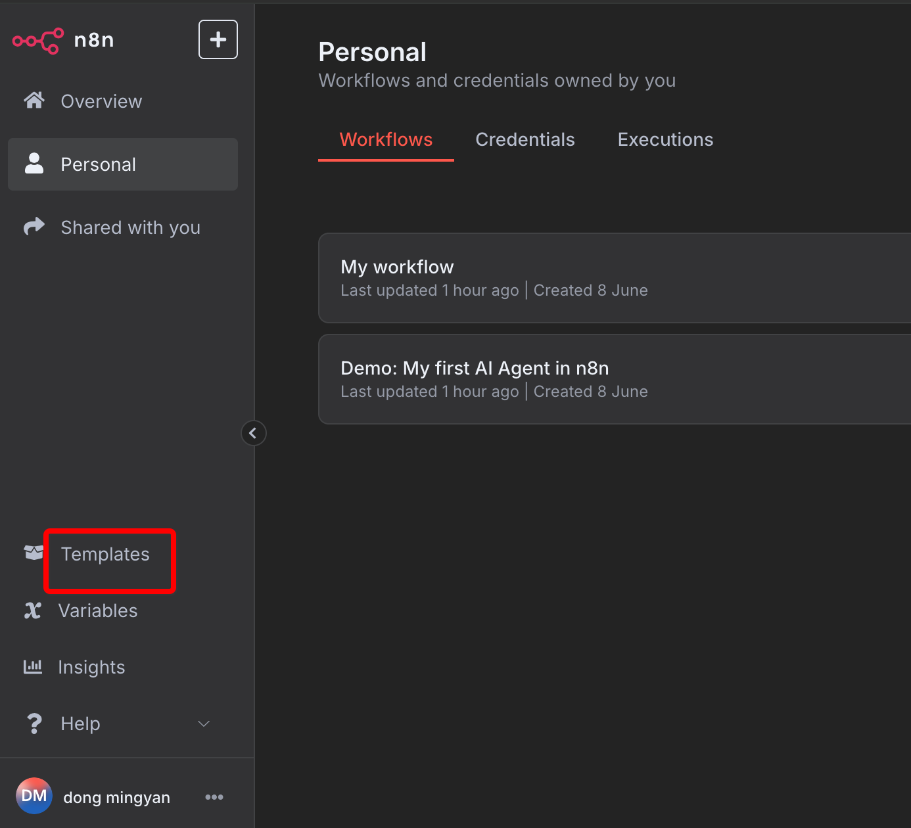
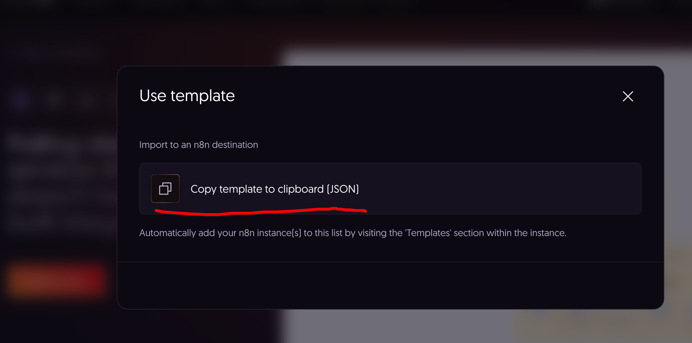

## n8n
n8n是一款开源的工作流工具，官方为此提供了大量的工作节点，可以便捷的实现各种自动化流程；同时由于开源特性，社区活跃度非常高。在github达到了惊人的105K Star.
由于在线版本，收费并不便宜，作为程序员的我们，完全可以搭建一个自己的n8n。

废话不多说直接开始。

### 一、快速开始
n8n的github地址为是，https://github.com/n8n-io/n8n ，看了下部署非常简单。

PS： 确保你已经安装好了docker。

直接使用docker部署，我们快速尝试下。
```shell
docker volume create n8n_data
docker run -it --rm --name n8n   -p 5678:5678   -v n8n_data:/home/node/.n8n   -e N8N_SECURE_COOKIE=false   docker.n8n.io/n8nio/n8n

# 使用 N8N_SECURE_COOKIE：false 是因为默认情况下没有开启https无法访问，所以我们关掉它
# 使用rm 停掉后自动删掉容器
```
非常顺利，在整个过程完成后会看到一个访问的提示，如果是你的本地。直接进入`http://localhost:5678/`就可以访问。


> 补充信息
首次访问时，会要求你填写`Email`、用户姓名、`密码`等信息；这里的邮箱不要乱填哦。这个后续会用于接收（解锁付费功能的 license key）
另外这里填写信息也就是你做为管理员的账户信息。


好啦，那是不是整个过程到此就结束了呢。

并没有，因为上面的n8n还有几个问题
1. 由于是内网部署，因此不能在公网访问（像webhook的功能就完全无法使用）
2. 默认情况下数据库使用的sqlites，对并发支持也不好

好，我们下面解决上面的问题

### 二、使用cloudflare隧道做内网打通
首先这个是免费的，你唯一需要做的就是去买一个域名。域名非常便宜，便宜的就几块人民币而已。
1. 可以到 https://www.namesilo.com/ 去购买域名
2. 注册cloudflare账号，然后配置你域名的解析

3. 开启隧道（需要在你的内网电脑上安装对应的包，按需下载）

4. 配置隧道的公开服务器

配置完成后，会自动将你的n8n域名解析添加进去。


### 三、通过docker-compose.yaml 启动n8n
在的部署机器做如下操作
1. 创建目录`mkdir n8n`
2. 创建文件`touch n8n/docker-compose.yaml`
```yaml
version: '3.8'

services:
  n8n:
    image: docker.n8n.io/n8nio/n8n:latest # 建议替换为具体的版本号，例如 :1.30.0
    restart: always
    # 如果你没有反向代理，或者想直接通过HTTP访问n8n，请取消注释下面这行
    # 这样n8n的5678端口会映射到宿主机的5678端口
    ports:
      - "5678:5678" # <--- 如果没有反向代理，请务必取消注释此行！
    volumes:
      - n8n_data:/home/node/.n8n # n8n的数据卷
    environment:
      # n8n 核心配置
      - N8N_HOST=your_domain
      - N8N_PROTOCOL=http # <--- 将HTTPS改为HTTP
      - WEBHOOK_URL=http://n8n.your_domain/ # <--- 将HTTPS改为HTTP
      - N8N_PORT=5678 # n8n内部监听端口
      - N8N_SECURE_COOKIE=false // 这里设置为false是由于我们没有打开https，只有false本地才可以访问

      # 数据库配置 (PostgreSQL)
      - DB_TYPE=postgres
      - DB_POSTGRES_HOST=postgres # 数据库服务名，在docker-compose网络中
      - DB_POSTGRES_PORT=5432
      - DB_POSTGRES_DATABASE=n8n # n8n使用的数据库名
      - DB_POSTGRES_USER=n8n # n8n连接数据库的用户名
      - DB_POSTGRES_PASSWORD=postgres_password # <-- 替换为强密码

      # 安全配置
      - N8N_ENCRYPTION_KEY=your_strong_encryption_key # <-- 替换为随机生成的强密钥，用于加密凭据

      # 其他可选配置
      - TZ=Asia/Shanghai # 设置时区

    depends_on:
      - postgres # 确保postgres服务在n8n之前启动

  postgres:
    image: postgres:15 # 推荐使用特定版本，例如 postgres:15
    restart: always
    volumes:
      - n8n_postgres_data:/var/lib/postgresql/data # PostgreSQL数据卷
    environment:
      - POSTGRES_DB=n8n # 数据库名，与n8n配置一致
      - POSTGRES_USER=n8n # 用户名，与n8n配置一致
      - POSTGRES_PASSWORD=postgres_password # <-- 替换为强密码，与n8n配置一致

volumes:
  n8n_data:
  n8n_postgres_data:
```
记得把上面环境变量中你的域名，密码等信息修改成你的。

启动`docker compose -f n8n/docker-compose.yaml up -d`
PS：一开始执行时候最好不要带上`-d`这样方便看看是否有啥报错没

一般来说非常顺利，我也就一次成功啦。


### 四、nginx配置
我们使用nginx反向代理,假设你已经安装了nginx
在/etc/nginx/sites-available/中添加 n8n文件，内容如下
```nginx
server {
    listen 80;
    server_name n8n.your-domain; # <-- ！！！重点检查这里，确保是 n8n.your-domain 且没有拼写错误

    location / {
        proxy_set_header Host $host;
        proxy_set_header X-Real-IP $remote_addr;
        proxy_set_header X-Forwarded-For $proxy_add_x_forwarded_for;
        proxy_set_header X-Forwarded-Proto $scheme;
        proxy_set_header X-N8N-Proxy-Uri $request_uri; 

        # WebSocket 支持
        proxy_http_version 1.1;
        proxy_set_header Upgrade $http_upgrade;
        proxy_set_header Connection "upgrade";
    }

    access_log /var/log/nginx/n8n.access.log;
    error_log /var/log/nginx/n8n.error.log;
}
```

链接到激活
```shell
sudo ln -s /etc/nginx/sites-available/n8n /etc/nginx/sites-enabled/n8n
```

启动nginx `systemctl start nginx`


### 五、使用它
直接访问`https://your-domain` 没错，这里就是`https`，cloudflare会自动带上https非常贴心。

登录完成后，我们该怎么玩n8n呢？这里有一个小技巧，我们去copy别人的模版，直接上手玩，使用n8n copy别人的模版非常简单。
点击`templates` 跳转模版页面,这里有非常多的模版


选择任意模版 -> user for free - 复制，然后回到我们的n8n工作流区域，快捷键粘贴即可。


