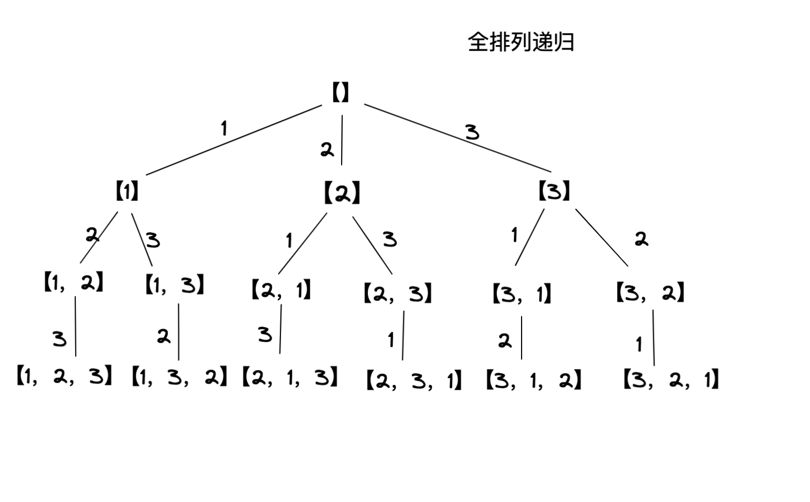

##### 定义
在探讨问题前先根据自己的理解下个定义，因为这几种从词上确实不容易区分开
1. 排列 - 讲究的是顺序，只要顺序不同就算一种
2. 子集 - 讲究元素本身，和顺序无关，它囊括各种数量的情况
   比如：`=> [[], [1], [1, 2], [1, 2, 3], [1, 3], [2], [2, 3], [3]]`
3. 组合 - 限定元素个数的子集
   比如: `=> [[1, 2], [1, 3], [2, 3]]` 元素个数为2

##### 核心
这里由于元素是否重复，可否重复选择，情况非常多；
但是我们只需要深刻的掌握排列和子集（PS：元素不重复不可重复选择）这两种算法，其它可以在此基础上推导出来
也就是进行一些剪枝操作就行

##### 排列遍历代码(核心基础)
关键：路径中已选择的元素，后续不可再选择

```ruby
def cal(nums)
  @res = [] # 初始化结果数组
  backtrace(nums)
  @res 
end

def backtrace(select_list, path = [])
  @res << path.clone

  select_list.each do |val|
    # 选中
    path << val
    backtrace(select_list - [val], path.clone)
    # 撤销
    path.pop
  end
end

cal([1,2,3])
#=> [[], [1], [1, 2], [1, 2, 3], [1, 3], [1, 3, 2], [2], [2, 1], [2, 1, 3], [2, 3], [2, 3, 1], [3], [3, 1], [3, 1, 2], [3, 2], [3, 2, 1]]
```

###### 子集遍历代码（核心基础）
关键：路径中除了已选择元素不可选外，在此前的索引也不可选

```ruby
def cal(nums)
  @res = [] # 初始化结果集数组
  backtrace(nums)
  @res
end

def backtrace(select_list, path = [])
  @res << path.clone

  select_list.each_with_index do |val, i|
    # 选中
    path << val
    # 下一次选择列表 自己前面的索引都不能选 区别于排列
    next_list = (i + 1) == select_list.length ? [] : select_list[(i+1)..-1].clone
    backtrace(next_list, path.clone)
    # 撤销
    path.pop
  end
end

cal([1,2,3])
# => [[], [1], [1, 2], [1, 2, 3], [1, 3], [2], [2, 3], [3]]
```

##### 组合（从子集-演变）
关键：只取元素个数为特定的路径

```ruby
# k个元素的组合
def cal(nums, k)
  @res = []
  backtrace(nums, k)
  @res
end

def backtrace(select_list, k, path = [])
  # 只记录元素个数为k
  if path.length == k
    @res << path.clone
    return 
  end

  select_list.each_with_index do |val, i|
    # 选中
    path << val
    # 下一次选择列表 自己前面的索引都不能选 区别于排列
    next_list = (i + 1) == select_list.length ? [] : select_list[(i+1)..-1].clone
    backtrace(next_list, k, path.clone)
    # 撤销
    path.pop
  end
end

cal([1,2,3], 2)
# => [[1, 2], [1, 3], [2, 3]]
```


