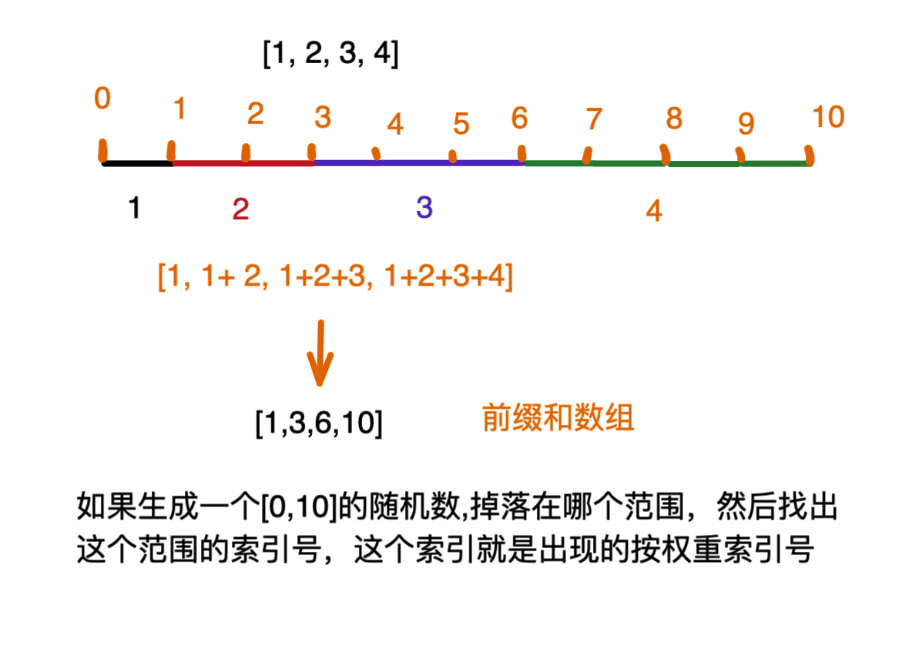

#### 随机算法权重
也就是按照权重去随机返回数据，本质上利用前缀和实现

##### 问题
比如给定一个数组[10,12,15,16],现在要求按照[1,2,3,4]
也就是
1. 索引0元素权重：1/1+2+3+4
2. 索引1元素权重：2/1+2+3+4
3. 索引2元素权重：3/1+2+3+4
...
依次类推



```ruby
# nums 随机元素数组
# weights 对应索引位权重数组
def random_by_weight(nums, weights)
  pre_sum_arr = pre_sum(weights)
  # 最大索引边界-前最和数组最后的元素
  max_i = pre_sum_arr.last
  # 随机数[0,max_i)
  rand_num = rand(max_i)
  # 找出随机数所属的前缀和索引
  index = find_pre_sum_index(pre_sum_arr,rand_num)
  nums[index]
end

# 前缀和数组
def pre_sum(weights)
  pre_sum_arr = []
  pre_sum_arr[0] = weights.first # 第一个权重相等
  # 长度
  len = weights.length
  # 从1开始跳过0
  (1..(len-1)).each do |i|
    pre_sum_arr[i] = pre_sum_arr[i-1] + weights[i]
  end
  pre_sum_arr
end

# 查前缀和索引
def find_pre_sum_index(pre_sum,val)
  # 左右指针
  left = 0
  right = pre_sum.length - 1
  while(left <= right)
    mid = left + (right - left) / 2
    if pre_sum[mid] == val
      return mid
    elsif pre_sum[mid] > val
      right = mid - 1 # 右指针左移动
    elsif pre_sum[mid] < val
      left = mid + 1 # 左指针右移动
    end
  end
  # 退出条件 left - 1 = right
  left
end

nums = [10,12,15,16]
weights = [1,2,3,4]
random_by_weight(nums, weights)
```


