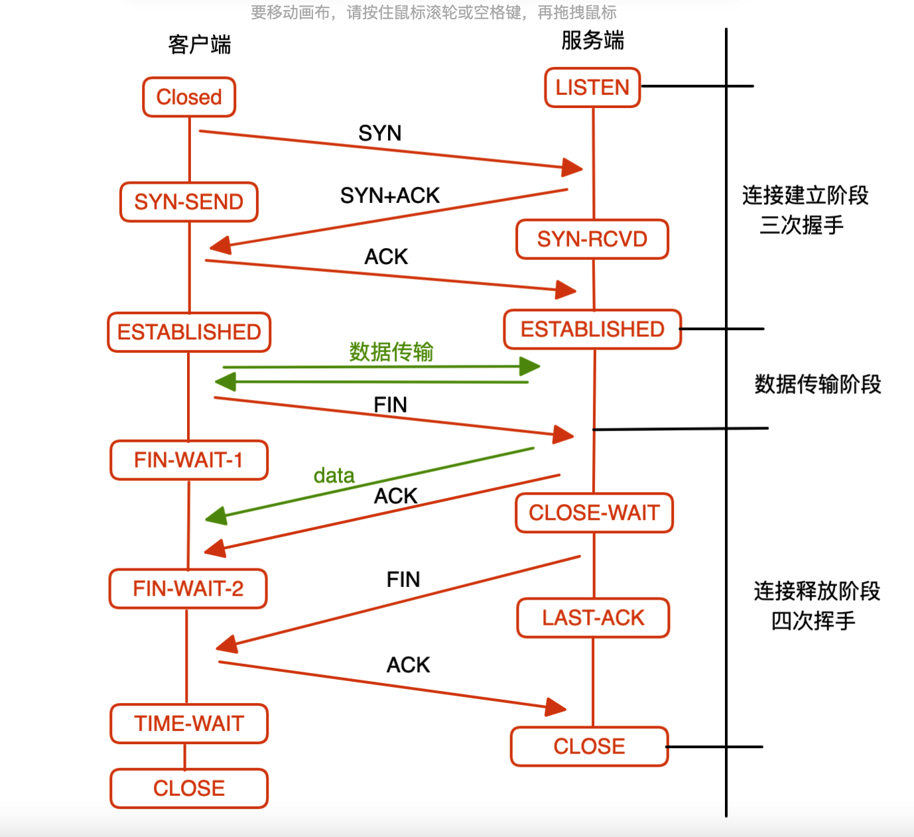

#### 图解

##### 为什么是三次握手？
首先，握手的目的是：
> 确保双方收发能力都正常

这里存在如下隐含条件：
由于数据包发送过程中可能会丢失，不一定能保证正常到达接收方；
1. 因此对于发送方来说，是没法直接确认自己的发送能力；
2. 只有通过对方接收到自己发送数据包，并做出应答才能确认自己的发送能力

我们来分析：
第一阶段：client --syn--> server
服务端在收到数据包后可以确认：
1. 客户端发送能力ok
2. 自己（服务端）接收能力ok

第二阶段：client <---syn+ack-- server
客户端收到服务端数据包可以确认：
1. 自己（客户端）收能力ok
2. 自己（客户端）发能力ok(PS: 因为得到了响应)
3. 服务端收能力ok(PS:收到了自己的件)
4. 服务端发能力ok(PS:发给自己了)

走到这一步，客户端已经知道自己和服务端的收发能力都ok;
> but 但是，服务端此时还不知道自己的发送能力、客户端接收能力是否k?
因此还需要客户端向服务端确认

第三阶段：client --ACK--> server
服务端收到后确认：
1. 自己（服务端）发送能力ok
2. 客户端接收能力ok

##### 为什么握手只要三次，挥手却要四次？
在握手阶段，服务端是将ack和syn一起发送给客户端的；但是在挥手阶段，ACK和FIN是分开发送的，所以多了一次。

那么为啥不能一起发呢？
因为在客户端发送FIN后，
1. 客户端还具备数据接收能力
2. 服务端并不会立马停止数据的发送，而是要等数据发送完后，才向客户端发送FIN

##### 为什么在挥手结点客户端发送完ack后不会立马进入close?
因为这个ack数据包是可能丢失的，为了保证安全送达，会留下充足的时间（PS：最大报文生成时间）后，才能进入close

