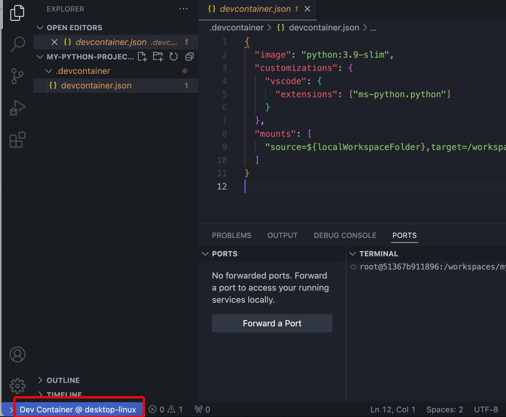
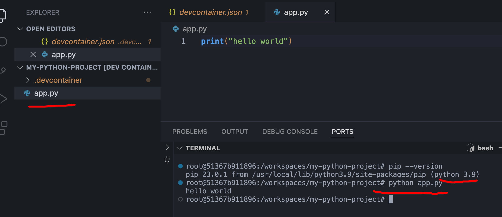

## docker 快速构建开发环境
我们知道docker，它能够将我们的开发环境打包成一个镜像，这样我们就可以在任何地方运行这个镜像，而不需要担心环境的问题，这对部署来说相当便利。 

但是，**在项目开发阶段，开发环境的搭建仍然是一件令人头疼的事，通常需要装各种各样的软件，配置各种环境变量，安装各种依赖等等。** 那么docker是否能帮我解决这个问题呢？答案是肯定的。

我们可以**通过docker一次构建好一个开发环境，在开发时启动一个开发环境的容器，让vscode连接这个容器开发**就ok啦。

废话不多少，我们以`python`为例，演示一下如何构建一个`python`开发环境。

### 一、准备工作
假设您已对docker有了基本了解，自己已经安装好了docker，并且已经安装好了vscode。

在vscode中安装一个插件`Dev Containers`待用。

PS：如果您还不会docker，建议可以去看看我的 [一小时快速上手docker](https://juejin.cn/post/7359402386605588490)文章。

搭建开发环境有两种方式：
1. 没有开发环境镜像，编写`devcontainer.json`文件启动
2. 已有开发环境的镜像（运行进行后，连接容器）

下面分别介绍

### 二、方式一：利用`devcontainer.json`文件启动
我们打卡vscode，在目录下创建一个`.devcontainer`目录，目录下创建一个`devcontainer.json`文件，内容如下：

```json
{
  "image": "python:3.9-slim",
  "customizations": {
    "vscode": {
      "extensions": ["ms-python.python"]
    }
  },
  "mounts": [
    "source=${localWorkspaceFolder},target=/workspace,type=bind"
  ]
}
```

解释一下：
- `image`：指定基础镜像，这里我们使用`python:3.9-slim`，当然你也可以使用其他镜像，比如`ubuntu:latest`等等。
- `customizations`：自定义配置，这里我们安装了`ms-python.python`vscode 插件，当然你也可以安装其他的插件。
- `mounts`：挂载目录，这里我们将当前目录挂载到容器的`/workspace`目录下，这样我们就可以在容器中访问当前目录下的文件了。


好啦，**上面就一个中心——构建一个python 3.9版本的开发环境**,下面我们打卡vscode 的命令控制版,mac上是`cmd+shift+p`，windows上是`ctrl+shift+p`，输入`Dev Containers: Reopen in Container`，等运行完就正常进入了。

进入成功后大概这个样子。


PS：这里它会下载好`python:3.9-slim`镜像，并且启动一个容器，并且自动安装好我们指定的插件；第一次会比较慢。

现在我们来玩一下，在当前目录下创建一个`app.py`文件，内容如下：

```python
print("hello world")
```

然后在终端中运行`python app.py`，输出`hello world`，说明我们的开发环境已经搭建好了。


### 三、方式二：利用已有镜像启动
另外一种方式是我们实现构建好镜像，然后启动容器，连接容器进行开发。

为了演示，我就不去添加dockerfile了，直接使用官方的`python`镜像；

为了方便测试，我们`close`上面的容器连接。在终端运行如下命令：

```shell
docker run -d \
  --name python-dev \
  -v $(pwd):/workspace \
  python:3.9-slim \
  sleep infinity   
```

这启动了一个名为`python-dev`的容器，并且将当前目录挂载到容器的`/workspace`目录下。

然后我们打开vscode，打开命令控制版，输入：`Dev Containers: Attach to Running Container`，然后选择`python-dev`容器，等运行完就正常进入了。

ok啦，可以自行测试下。

### 四、其它
如果我们本地电脑的资源有限，性能不好；这种方式也是支持远程电脑上运行docker容器连接的。

docker的这种便利性，为我们构建不同的开发环境提供了极大的便利性，只需要搞定docker的安装，其它就交给docker了。

有了这种方式再也不担心换电脑带来了环境配置的痛苦了，真的是一种幸福，您说是吧。


