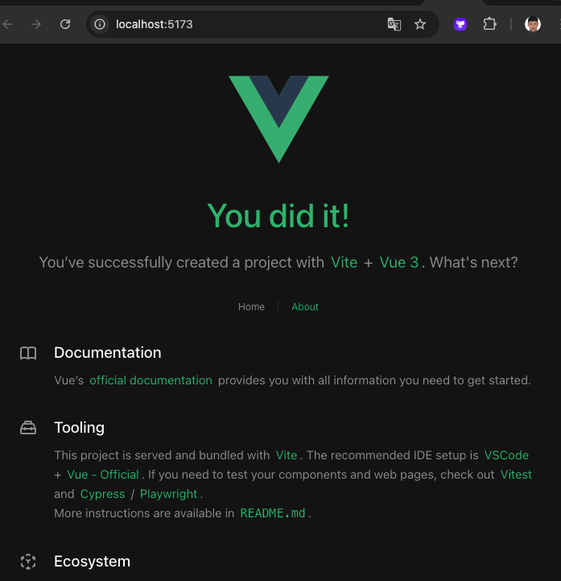
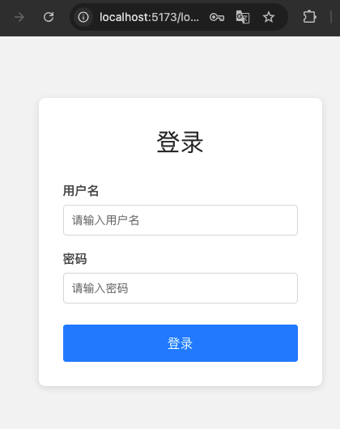
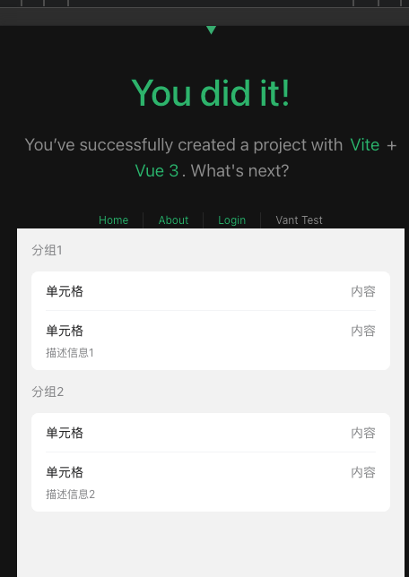

## vue
做为一个后端，很多时候想实现一个完整的功能产品，奈何前端技术太菜，开发时总感觉力不从心；随着ai技术的快速发展，让我们有能力快速开发自己的产品，因此掌握一些前端技术显得非常必要。

一番了解后，大概知道`vue`入门非常简单，另外它同时也可以支持`小程序`、`app`的开发，基本还是比较全面，今天我们一起开始学习它吧。

不同于常规的教程，从头开始一个个知识点讲解，我们要的是**整体感知，知道它是怎么玩的。**；因此我们主要从整体的角度的去做一个`vue`项目，结合`ui`框架（后端多半都不太会写css,非常有必要）,然后部署上线去做，相信把这一切看完后，你会有一个感受——**原来是这么玩的**。

我们是从整体角度出发，因此知识点都是带一下，不会涉及过分细节。好啦，说了这么多，让我们开始吧。

### 一、环境准备
首先，先确保您的本地电脑有安装`node.js`,它是一个javscript运行环境，前端开发都需要装它。
使用`node -v`,如果有输出，则安装好了。
另外它还自带一个包管理器`npm`,可以通过通过`npm -v`查看版本。

在包管理方面，`pnpm`比`npm`更好，因此我们采用`pnpm`管理包，通过`npm install -g pnpm`安装 `pnmp`

安装完后`pnpm -v`验证安装成功。

好啦，准备就绪，开始！！！

### 二、项目准备
切换到一个你自己的开发目录下，执行`pnpm create vue@latest`
```shell
pnpm create vue@latest
┌  Vue.js - The Progressive JavaScript Framework
│
◇  Project name (target directory):
│  learn-vue
│
◆  Select features to include in your project: (↑/↓ to navigate, space to select, a to toggle all, enter to confirm)
│  ◼ TypeScript
│  ◻ JSX Support
│  ◼ Router (SPA development)
│  ◻ Pinia (state management)
│  ◻ Vitest (unit testing)
│  ◻ End-to-End Testing
│  ◼ ESLint (error prevention)
│  ◻ Prettier (code formatting)
└
```
它会有些提示，
- project name 项目名，我这里写的`learn-vue`,你随意。
- 一些选择我选择，`TypeScript`、`Router`（路由）、`ESLint`(更好的检查提示)。

选好后，`enter`
```shell
pnpm create vue@latest
┌  Vue.js - The Progressive JavaScript Framework
│
◇  Project name (target directory):
│  learn-vue
│
◇  Select features to include in your project: (↑/↓ to navigate, space to select, a to toggle all, enter to confirm)
│  TypeScript, Router (SPA development), ESLint (error prevention)
│
◆  Install Oxlint for faster linting? (experimental)
│  ○ Yes / ● No
└
```
然后问你要安装Oxlint不，直接回车就行。

然后你将看到
```shell
pnpm create vue@latest
┌  Vue.js - The Progressive JavaScript Framework
│
◇  Project name (target directory):
│  learn-vue
│
◇  Select features to include in your project: (↑/↓ to navigate, space to select, a to toggle all, enter to confirm)
│  TypeScript, Router (SPA development), ESLint (error prevention)
│
◇  Install Oxlint for faster linting? (experimental)
│  No

Scaffolding project in /Users/dongmingyan/vue/learn-vue...
│
└  Done. Now run:

   cd learn-vue
   pnpm install
   pnpm dev

| Optional: Initialize Git in your project directory with:
   
   git init && git add -A && git commit -m "initial commit"
```
说明这个`vue`自定义的脚手架项目都搭建起来了，照着上面的提示执行
```shell
cd learn-vue
pnpm install
pnpm dev
```
成功后您会看到
```
pnpm dev

> learn-vue@0.0.0 dev /Users/dongmingyan/vue/learn-vue
> vite


  VITE v6.2.6  ready in 1204 ms

  ➜  Local:   http://localhost:5173/
  ➜  Network: use --host to expose
  ➜  Vue DevTools: Open http://localhost:5173/__devtools__/ as a separate window
  ➜  Vue DevTools: Press Option(⌥)+Shift(⇧)+D in App to toggle the Vue DevTools
  ➜  press h + enter to show help
```

在浏览器访问`http://localhost:5173/`发现都运行起来了。


一切正常符合我们的预期。

### 三、了解目录结构
前面我们通过vue的脚手架，帮我们生成了一个vue的项目，但是我们完全不知道这个项目的结构，因此我们先来看下。
```shell
tree -L 2
.
├── README.md
├── env.d.ts
├── eslint.config.ts
├── index.html
├── node_modules
│   ├── @tsconfig
│   ├── @types
│   ├── @vitejs
│   ├── @vue
│   ├── eslint -> .pnpm/eslint@9.24.0_jiti@2.4.2/node_modules/eslint
│   ├── eslint-plugin-vue -> .pnpm/eslint-plugin-vue@10.0.0_eslint@9.24.0_jiti@2.4.2__vue-eslint-parser@10.1.3_eslint@9.24.0_jiti@2.4.2__/node_modules/eslint-plugin-vue
│   ├── jiti -> .pnpm/jiti@2.4.2/node_modules/jiti
│   ├── npm-run-all2 -> .pnpm/npm-run-all2@7.0.2/node_modules/npm-run-all2
│   ├── typescript -> .pnpm/typescript@5.8.3/node_modules/typescript
│   ├── vite -> .pnpm/vite@6.2.6_@types+node@22.14.1_jiti@2.4.2/node_modules/vite
│   ├── vite-plugin-vue-devtools -> .pnpm/vite-plugin-vue-devtools@7.7.2_rollup@4.40.0_vite@6.2.6_@types+node@22.14.1_jiti@2.4.2__vue@3.5.13_typescript@5.8.3_/node_modules/vite-plugin-vue-devtools
│   ├── vue -> .pnpm/vue@3.5.13_typescript@5.8.3/node_modules/vue
│   ├── vue-router -> .pnpm/vue-router@4.5.0_vue@3.5.13_typescript@5.8.3_/node_modules/vue-router
│   └── vue-tsc -> .pnpm/vue-tsc@2.2.8_typescript@5.8.3/node_modules/vue-tsc
├── package.json
├── pnpm-lock.yaml
├── public
│   └── favicon.ico
├── src
│   ├── App.vue
│   ├── assets
│   ├── components
│   ├── main.ts
│   ├── router
│   └── views
├── tsconfig.app.json
├── tsconfig.json
├── tsconfig.node.json
└── vite.config.ts
```

下面大概说明下：
- `main.ts` 入口文件，这和其它语言（比如`go`）一样，凡是`main`的都是一个入口。
- `node_modules 目录` 是项目安装了包存放位置，我们不用管它（提交代码仓库时，也不要提交上去，它是根据`package.json`执行包安装`pnpm install`自动装好的。
- `index.html` 是vue的主页面（home）文件
- `public` 主要用于存放图片、logo等等
- `src 目录` 是我们着重注意的目录，基本开发都是在这里
- `pnpm-lock.yaml`主要用于存放包的具体版本文件，需要提交到git
- `tsconfig.json` 主要是typescript的配置文件,可以先不用关注
- `vite.config.ts` vite的配置文件（控制应用如何启动、支持热更新-修改代码立即生效）

### 四、细看如何运作
前面我们看了目录结构是啥，但是还没看一个vue的各个部分是如何协作的。

- `main.ts`
```typescript
import './assets/main.css'

import { createApp } from 'vue'
import App from './App.vue'
import router from './router'

const app = createApp(App)

app.use(router)

app.mount('#app')
```

从入口看，这个文件就是从vue中导入了`createApp`、`App`我们初始化了一个app，然后在app上安装了路由（`router`）
最后一行`app.mount('#app')` 是把这个vue app挂载到`index.html`页面的一个叫app的id属性上了。

顺着我们去看下`App.vue`,这里内容稍多，我们简化着看

```javascript
<script setup lang="ts">
import { RouterLink, RouterView } from 'vue-router'
import HelloWorld from './components/HelloWorld.vue'
</script>

<template>
  <header>
    

    <div class="wrapper">
      <HelloWorld msg="You did it!" />

      <nav>
        <RouterLink to="/">Home</RouterLink>
        <RouterLink to="/about">About</RouterLink>
      </nav>
    </div>
  </header>

  <RouterView />
</template>

<style scoped>
</sytle>
```

整体上三个部分
- `<script> `—— typeScript,这里导入了路由、和HelloWorld组件
- `template` 模版，这在vue中是一个特殊的部分，一个组件最多只能有一个template模版，它代表的是html部分
- `style` 当然是样式部分，你看它内部带了一个`scoped`，它代表样式只在当前vue文件生效

`<HelloWorld msg="You did it!" />` 这里是组件的使用，看起来和我们使用标准的html标签查不多，它是自闭合的。这里的`msg`属性,是向HelloWorld组件中传递的数据，先了解即可。

然后我们可以看到，
```
<nav>
  <RouterLink to="/">Home</RouterLink>
  <RouterLink to="/about">About</RouterLink>
</nav>
```
这里使用了vue的`RouterLink`组件,放置了两个路由`Home`和`Abount`

我看再看下路由`router/index.ts`
```typescript
import { createRouter, createWebHistory } from 'vue-router'
import HomeView from '../views/HomeView.vue'

const router = createRouter({
  history: createWebHistory(import.meta.env.BASE_URL),
  routes: [
    {
      path: '/',
      name: 'home',
      component: HomeView,
    },
    {
      path: '/about',
      name: 'about',
      // route level code-splitting
      // this generates a separate chunk (About.[hash].js) for this route
      // which is lazy-loaded when the route is visited.
      component: () => import('../views/AboutView.vue'),
    },
  ],
})
```
这里定义了两个路由 `home`和`abount`,也就是在`App.vue`中使用的路由

我们看到这里大概就可以知道`main.ts` 引用 `App.vue` 而 `App.vue`引用了`HelloWorld.vue`，**本质上vue引用就是由一些列组件组合而成页面构成。**

`vue`给我们提供了一些特殊的组件，比如`路由`/`状态管理`等等，方便我们使用。

### 五、动动手
理论是枯燥的，我们还是要动手自己去练练。

#### 1. login页面
假设我们要一个登录页面，首先，我们添加一个路由在`router/index.ts`中添加
```typescript
const router = createRouter({
  history: createWebHistory(import.meta.env.BASE_URL),
  routes: [
    // ...
    {
      path: '/login',
      name: 'login',
      component: () => import('../views/LoginView.vue'),
    },
  ],
})
```
然后我们去添加登录页面,`views/LoginView.vue`
```vue
<template>
  <div>
    <h1>Login</h1>
  </div>
</template>

<script setup lang="ts">
</script>

<style scoped>
</style>
```
然后在App.vue中把链接加上
```vue
<nav>
  <RouterLink to="/">Home</RouterLink>
  <RouterLink to="/about">About</RouterLink>
  <RouterLink to="/login">Login</RouterLink><!-- 登录 -->
</nav>
```
然后在首页就能看到登录按钮，可以点击，也能进入登录页面，说明我们成功了。

#### 2. 美化完成
现在登录页虽然实现了，但是就一个标题太low了，让我们把输入框和按钮加上。

重写`login.vue`
```vue
<template>
  <div class="login-container">
    <div class="login-box">
      <h1>登录</h1>
      <div class="form-item">
        <label for="username">用户名</label>
        <input 
          type="text" 
          id="username" 
          v-model="username" 
          placeholder="请输入用户名"
        />
      </div>
      <div class="form-item">
        <label for="password">密码</label>
        <input 
          type="password" 
          id="password" 
          v-model="password" 
          placeholder="请输入密码"
        />
      </div>
      <button @click="handleLogin" class="login-button">登录</button>
    </div>
  </div>
</template>

<script setup lang="ts">
import { ref } from 'vue'
import { useRouter } from 'vue-router'

const router = useRouter()
const username = ref('')
const password = ref('')

const handleLogin = () => {
  if (!username.value || !password.value) {
    alert('请输入用户名和密码')
    return
  }
  
  // 这里应该加入真实的登录逻辑
  console.log('登录信息：', username.value, password.value)
  
  // 模拟登录成功
  alert('登录成功')
  // 登录成功后跳转到首页
  router.push('/')
}
</script>

<style scoped>
.login-container {
  display: flex;
  justify-content: center;
  align-items: center;
  height: 100vh;
  background-color: #f5f5f5;
}

.login-box {
  width: 350px;
  padding: 30px;
  background-color: white;
  border-radius: 8px;
  box-shadow: 0 2px 10px rgba(0, 0, 0, 0.1);
}

h1 {
  text-align: center;
  margin-bottom: 24px;
  color: #333;
}

.form-item {
  margin-bottom: 16px;
}

label {
  display: block;
  margin-bottom: 6px;
  font-weight: bold;
  color: #555;
}

input {
  width: 100%;
  padding: 10px;
  border: 1px solid #ddd;
  border-radius: 4px;
  font-size: 14px;
  box-sizing: border-box;
}

input:focus {
  border-color: #40a9ff;
  outline: none;
  box-shadow: 0 0 0 2px rgba(24, 144, 255, 0.2);
}

.login-button {
  width: 100%;
  padding: 12px;
  background-color: #1890ff;
  color: white;
  border: none;
  border-radius: 4px;
  font-size: 16px;
  cursor: pointer;
  margin-top: 10px;
}

.login-button:hover {
  background-color: #40a9ff;
}

.login-button:active {
  background-color: #096dd9;
}
</style>
```

然后看我们登录页面，如图：

高大上了不少。

下面重点说下这里的知识点，
- 值初始化
```javascript
import { ref } from 'vue'
// ref 是vue提供用于初始化值的工具 ref 可以初始化任意类型的值 使用是以.value方式获取值

const username = ref('') // 这里初始化username 为空字符串
const password = ref('') // 密码同理
```

- 双向绑定
```javascript
<input 
  type="text" 
  id="username" 
  v-model="username" 
  placeholder="请输入用户名"
/>
```
这里的`v-model="username" `是vue中用于提供双向绑定（输入框中值和外部js中username同步）输入框值的方式，这里`username`相当于一个变量。


- 事件触发
```html
<button @click="handleLogin" class="login-button">登录</button>
```
这里`@click="handleLogin"` @click是vue的事件触发，里面的`handleLogin`点击时执行的函数。

```javascript
const handleLogin = () => {
  if (!username.value || !password.value) {
    alert('请输入用户名和密码')
    return
  }
  
  // 这里应该加入真实的登录逻辑
  console.log('登录信息：', username.value, password.value)
  
  // 模拟登录成功
  alert('登录成功')
  // 登录成功后跳转到首页
  router.push('/')
}
```
上面我们直接通过`username.value`就能获取到输入框中`username`的值是多少，是不是很方便啊。

`vue`**最大的好处就是把数据和html之间的绑定做的特别方便**，如果我们手动去写`javascript`获取值，分配值会特别麻烦，这也是`vue`最大的好处。

当然，vue还有很多非常棒的特性（比如计算属性、循环、判断、状态管理...），限于篇幅我们不可能一一介绍，这里有一个感知就行。

#### 3. 引入ui库
自己手动写很多html、css还是很麻烦的，我们直接用现成的ui框架就好何必自己写呢，对不对。

考虑到大部分时需要使用移动端，因此我们引入[vant ui](https://vant-ui.github.io/vant/#/zh-CN/field)它对移动端很友好。

- 安装
```shell
pnpm install vant 
```

- 引入css(`main.ts`)中
```javascript
import './assets/main.css'
```

- 添加vantTest.vue页面和路由
vantTest页面内容
```vue
<template>
  <div class="van-test">
    <CellGroup title="分组1" inset>
      <Cell title="单元格" value="内容" />
      <Cell title="单元格" value="内容" label="描述信息1" />
    </CellGroup>

    <CellGroup title="分组2" inset>
      <Cell title="单元格" value="内容" />
      <Cell title="单元格" value="内容" label="描述信息2" />
    </CellGroup>
  </div>
</template>

<script setup lang="ts">
import { Cell, CellGroup } from 'vant'
</script>

<style scoped>
  .van-test {
  display: flex;
  height: 100vh;
  background-color: #f5f5f5;
  flex-direction: column;
}
</style>  
```

看到了吧 引入成功了 自带了`cell`样式。

### 六、部署
现在我们了解了基本的开发了，我们把代码发布到线上。

[vercel](https://vercel.com/) 提供了很好的支持，用它发布也非常简单。

首先，把我们的代码推到我们的github仓库。


