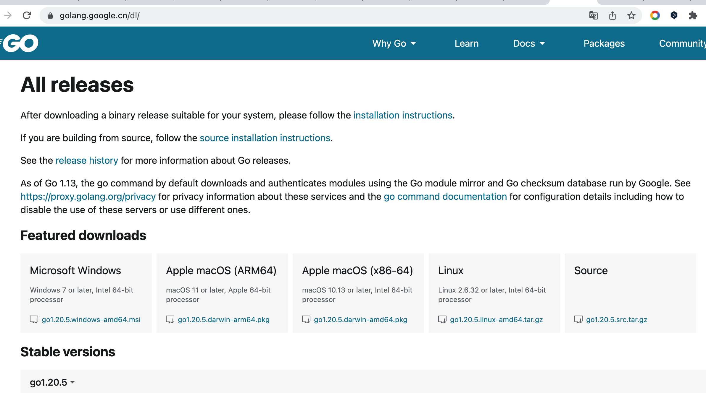

### 开始前的说明
在开始前，做些说明；最近打算学习go语言，打算采取以教助学的方式，一方面可以加深的自己对go的了解，另外一方面，希望可以对后来学习go的同学提供一些帮助；

在学习的过程中，我会把一些自己认为重要的知识点，进行记录和说明；但由于自己也是新手难免有不准确和错误的地方，欢迎指正。

### 认识go语言
#### 为什么要创建go语言？
1. go语言是由google公司创建的，主要目的是解决并发的问题；传统编程语言在对计算机的多核使用上不够友好。
2. 另外一个原因，像C/C++这类语言编译非常耗时
3. 当前的编程语言，C/C++性能很好，但是开发速度慢；动态语言开发很快，但是性能很差，go在性能和开发速度上找到了一种平衡


#### 有哪些语言特性?
1. 原生支持并发（用很少的代码量）
2. 编译速度很快
3. 做到了性能和开发速度的兼顾
4. 强类型静态语言（实现定义好类型）
5. 没有面向对象的类和继承(通过其它方式实现)
6. 易于部署和分享（build 后直接生成一个二进制文件）
7. 

#### 用它可以做什么?

### 学习go有哪些资源?
#### 官网
1. https://golang.google.cn/
官网整体还是不错的，安装、简单了解、框架等都很不错

#### 书籍
1. go入门指南（适合入门）
2. Go Web编程(适合入门，兼顾web开发)
3. go语言实战（比较深入，需要些基础）
4. go语言学习笔记（绝对算的是一个老手写的很地道的文章）
5. GoWeb开发实战（主要介绍框架Gin）
6. 跟煎鱼学go(不是从基础入手，书中带着实验的性质去研究探讨)
7. 

#### 在线书籍
1. https://github.com/unknwon/the-way-to-go_ZH_CN/blob/master/eBook/preface.md （go入门指南-github版，github浏览体验不是特别舒服，推荐书籍看）
2. https://gfw.go101.org/ (101适合入门)
3. https://www.topgoer.com/ 比较全面-不够细（语法、框架、微服务）

### 安装go
有多种安装方式，推荐使用官网的直接下载安装（下载好后一路next就可以了）

> 安装过程会自动配置好一些环境变量，目前看只有linux需要自己收到去设置环境变量
> mac电脑会将go安装到 /usr/local/go目录
```shell
go version # 检查go当前版本
# go version go1.20.5 darwin/amd64
```


