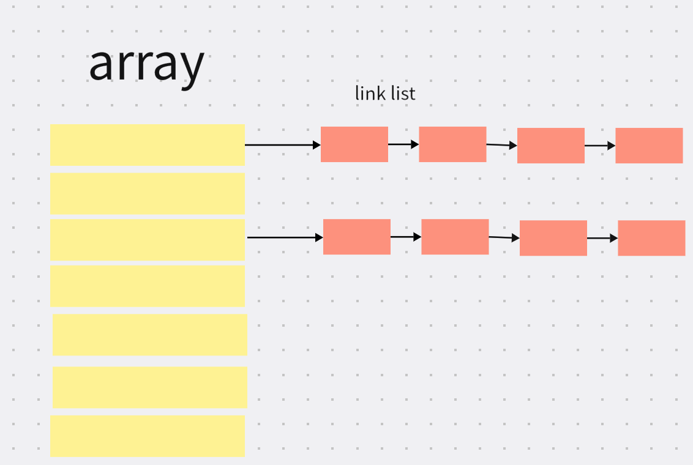

## map原理
map做为go中最常用的数据结构之一，我们除了需要知道基本的使用外，还需要知道它的原理

### 1. map底层实现
#### 1.1 map的通用实现
各种语言中都有对map的实现，对map的实现主要有两种方式：
1. 开放寻址法
2. 拉链法

它们的区别点在于对hash冲突的处理方式不同：
开放寻址法在发生hash冲突时，在计算出的索引位后继续往后找，找到第一个可用索引存放元素； 
拉链法，如果发现发生冲突则在当前索引位下放置链表，把这个元素接到链表上，即冲突的部分都在这个链表上。

由于拉链法性能较好，因此大多数语言中都采用的是拉链法，go也采用的这种方式。

对拉链法而言，map的实现方式主要依靠两种数据结构：
1. 数组：指向一个链表
2. 链表：解决hash冲突，存放键值对

也就是这样：

#### 1.2 go中map的实现
在go中map的实现是采用拉链法，它的主要利用的是数组而没有链表。

go中的map结构主要由hmap、bmap实现。
```go
type hmap struct {
	// Note: the format of the hmap is also encoded in cmd/compile/internal/reflectdata/reflect.go.
	// Make sure this stays in sync with the compiler's definition.
	count     int // # live cells == size of map.  Must be first (used by len() builtin)
	flags     uint8
	B         uint8  // log_2 of # of buckets (can hold up to loadFactor * 2^B items)
	noverflow uint16 // approximate number of overflow buckets; see incrnoverflow for details
	hash0     uint32 // hash seed

	buckets    unsafe.Pointer // array of 2^B Buckets. may be nil if count==0.
	oldbuckets unsafe.Pointer // previous bucket array of half the size, non-nil only when growing
	nevacuate  uintptr        // progress counter for evacuation (buckets less than this have been evacuated)

	extra *mapextra // optional fields
}

// A bucket for a Go map.
type bmap struct {
	// tophash generally contains the top byte of the hash value
	// for each key in this bucket. If tophash[0] < minTopHash,
	// tophash[0] is a bucket evacuation state instead.
	tophash [bucketCnt]uint8
	// Followed by bucketCnt keys and then bucketCnt elems.
	// NOTE: packing all the keys together and then all the elems together makes the
	// code a bit more complicated than alternating key/elem/key/elem/... but it allows
	// us to eliminate padding which would be needed for, e.g., map[int64]int8.
	// Followed by an overflow pointer.
}
```
它的具体实现我们不用太过关注细节，一来实现方式会随着时间而变化，二来，做为使用方知需要了解到关键点就行。

每个hmap有多个bmap,一个bmap就相当于一个数组索位,在bmap里可以存放键、值
在上面的hmap中有几个关键字段
1. `buckets`它相当于（[]bmap 数组）
2. `oldbuckets`扩容时的旧桶（用于存放旧的键值对）

在bmap中有一个特别的字段
`overflow` 溢出桶，指向另外一个bmap（每个bmap能存下的键值对是有限的，存不下就放到溢出桶）


#### 1.3 map扩容机制
什么时候触发扩容？
1. 负载因子（元素数量/总容量）超过阀值
2. 溢出桶太多（很多存不下的）

扩容方式有哪些？
1. 等量扩容（不会增加总容量，只是对当前map中元素进行整理）
2. 翻倍扩容（总容量在原来的基础上扩大一倍）

什么是渐进式扩容？
扩容不一次完成的，而是分摊到了每次（插入、删除、查找）中触发，这样相比一次完成整个扩容过程好处是，整个过程更加的平滑。

### 2. 注意事项
#### 2.1 不能并发读写（线程不安全）
先看下面的代码：
```go
package main

import (
	"fmt"
	"sync"
)

func main() {
	var wg sync.WaitGroup
	m := make(map[int]int)

	wg.Add(1)
	go func() {
		for i := 0; i < 1000; i++ {
			m[i] = i
		}
		wg.Done()
	}()

	wg.Add(1)
	go func() {
		for i := 0; i < 1000; i++ {
			fmt.Println(m[i])
		}
	}()

	wg.Wait()
}

// 会报错：fatal error: concurrent map read and map write
```
map是并发不安全的，在整个扩容的过程中涉及到新旧桶元素的迁移，迁移的过程有很多步骤，整个过程是没有加锁的，因此不安全。

如果要并发读写需要使用`sync.Map`
#### 2.2 遍历无序性
遍历的时候是随机获取到的key，因此遍历key是无序的
看下面代码
```go
package main

import (
	"fmt"
)

func main() {
	m := make(map[int]int)
	for i := 0; i < 10; i++ {
		m[i] = i
	}

	for k := range m {
		fmt.Println(k)
	}

	fmt.Println("======第二波===")
	for k := range m {
		fmt.Println(k)
	}
}

// 8
// 7
// 0
// 1
// 2
// 3
// 4
// 5
// 6
// 9
// ======第二波===
// 8
// 6
// 7
// 0
// 1
// 2
// 3
// 4
// 5
// 9
```

#### 2.3 不能获取val的地址
```go
package main

import "fmt"

func main() {
	m := make(map[int]int)

	m[1] = 2
	// 报错：invalid operation: cannot take address of m[1] (map index expression of type int)
	fmt.Println(&m[1])
}
```

#### 2.4 它是引用类型
传递到函数中改动会影响原值
```go
package main

import "fmt"

func main() {
	m := make(map[int]int)

	m[1] = 2
	fmt.Println("修改前map:", m)
	modifyMap(m) // 引用类型 会被修改
	fmt.Println("修改后map:", m)
}

func modifyMap(m map[int]int) {
	m[2] = 3
}

// 修改前map: map[1:2]
// 修改后map: map[1:2 2:3]
```

参考资料：
1. https://mp.weixin.qq.com/s/pvzO8wu13gLKK00zp77zWA
2. https://mp.weixin.qq.com/s/04aIpJCT9gdTaWaFX1lbrw
