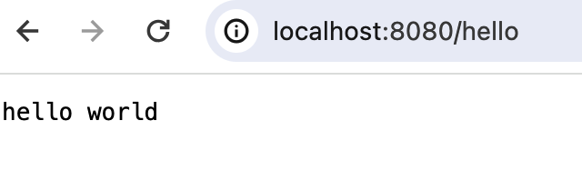
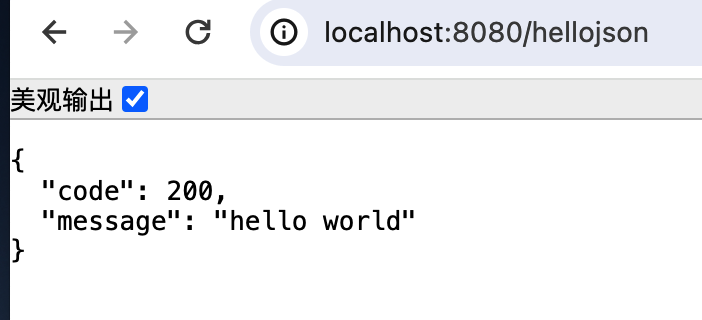
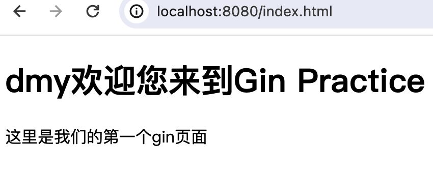

## gin quick start
gin是go最受欢迎的web框架之一。有必要熟练掌握，老规矩，我们还是按照一步步探索的方式，从零一起学习它。

### 1. 项目搭建
1. `mkdir gin_practice` 
2. `cd gin_practice`
3. `go mod init gin_practice` 初始化go mod
4. `touch main.go`创建main文件

`main.go`内容如下，我们先实现一个简单的hello world展示吧
```go
package main

import "github.com/gin-gonic/gin"

func main() {
	// 创建一个默认的路由器
	r := gin.Default()

	// 注册一个hello路由
	r.GET("/hello", func(c *gin.Context) {
		// 向客户端返回hello world
		c.String(200, "hello world")
	})
	r.Run() // 启动服务 默认在8080端口
}
```

执行`go mod tidy` 更新需要必须的包（这里会拉取`gin`包）
然后执行`go run .`跑起来
```shell
dongmingyan@pro ⮀ ~/go_playground/gin_practice ⮀ go run .
[GIN-debug] [WARNING] Creating an Engine instance with the Logger and Recovery middleware already attached.

[GIN-debug] [WARNING] Running in "debug" mode. Switch to "release" mode in production.
 - using env:   export GIN_MODE=release
 - using code:  gin.SetMode(gin.ReleaseMode)

[GIN-debug] GET    /hello                    --> main.main.func1 (3 handlers)
[GIN-debug] [WARNING] You trusted all proxies, this is NOT safe. We recommend you to set a value.
Please check https://pkg.go.dev/github.com/gin-gonic/gin#readme-don-t-trust-all-proxies for details.
[GIN-debug] Environment variable PORT is undefined. Using port :8080 by default
[GIN-debug] Listening and serving HTTP on :8080
```

好啦，浏览器打开`http://localhost:8080/hello`就能看到输出的"hello world"了。


到这里我们已经实现了一个最最基本的web请求，🎉🎉🎉


### 2. 基本的json响应
在大多数时候,前后端分离项目，响应的是`json`而不是字符串，因此我们来看看如何响应一个json.

```go
func main() {
	// 省略...

	// 响应json的hello路由
	r.GET("/hellojson", func(c *gin.Context) {
		c.JSON(200, gin.H{
			"code":    200,
			"message": "hello world",
		})
	})

	r.Run() // 启动服务
}
```

这个时候，`ctrl + c`终止掉，重新`go run .` 启动服务（PS：每次更新都需要重新启动）
浏览器输入`http://localhost:8080/hellojson`


### 3. html页面
要响应html页面，当然我们需要创建html页面，首先给它一个存放html页面的目录
- `mkdir templates`
- `touch templates/index.html` 新建index文件
  
`index.html`
```html
<html>
<head>
	<title>Welcome to Gin Practice</title>
</head>
<body>
	<h1>
    <!-- 通过 {{ .变量 }} 使用参数-->
    {{ .title }}欢迎您来到Gin Practice
  </h1>
	<p>这里是我们的第一个gin页面</p>
</body>
</html>
```

修改`main.go`文件
```go
func mian {
  // ...

  // 响应html页面
	r.LoadHTMLGlob("templates/*") // 加载模板文件
	//r.LoadHTMLFiles("templates/template1.html", "templates/template2.html")
	r.GET("/index.html", func(c *gin.Context) {
		c.HTML(200, "index.html", gin.H{
			"title": "dmy", // 传递给模板的数据
		})
	})

	r.Run() // 启动服务
}
```

重启服务后浏览器输入`http://localhost:8080/index.html`


可以响应html也可以传参到页面上，理论上不区分前后端一起开发也是支持的。

### 4. POST/PUT/Delete请求
前面我们快速的上手了响应了json和html页面，但是我们请求的方式都是`GET`，这里一起学习下其它的请求方式。

#### 4.1 POST
```go
func main {
  // ...

  // POST请求
	r.POST("/login", func(c *gin.Context) {
		name := c.PostForm("name")         // 获取表单数据
		password := c.PostForm("password") // 获取表单数据

		type any map[string]interface{}
		c.JSON(200, gin.H{
			"code":    200,
			"message": "login success",
			"data":    any{"name": name, "password": password}, // 传递给客户端的数据
		})
	})

	r.Run() // 启动服务
}
```
您可以在`postman`或者`apifox`这样的工具中测试
```shell
 dongmingyan@pro ⮀ ~ ⮀ curl --location --request POST 'http://localhost:8080/login' \
--form 'name="dmy"' \
--form 'password="123456"'

{"code":200,"data":{"name":"dmy","password":"123456"},"message":"login success"}
```

#### 4.2 PUT
```go
func main {
  // ...

  // PUT更新请求
	r.PUT("/user/:id", func(c *gin.Context) {
		id := c.Param("id") // 获取路径参数
		name := c.PostForm("name")
		password := c.PostForm("password")

		type any map[string]interface{}
		c.JSON(200, gin.H{
			"code":    200,
			"message": "update success",
			"data":    any{"id": id, "name": name, "password": password},
		})
	})
	r.Run() // 启动服务
}
```

为简单起见我们直接命令行执行吧。
```shell
curl --location --request PUT 'http://localhost:8080/user/12' \
  --form 'name="dmy"' \
  --form 'password="123456"'

{"code":200,"data":{"id":"12","name":"dmy","password":"123456"},"message":"update success"}
```


