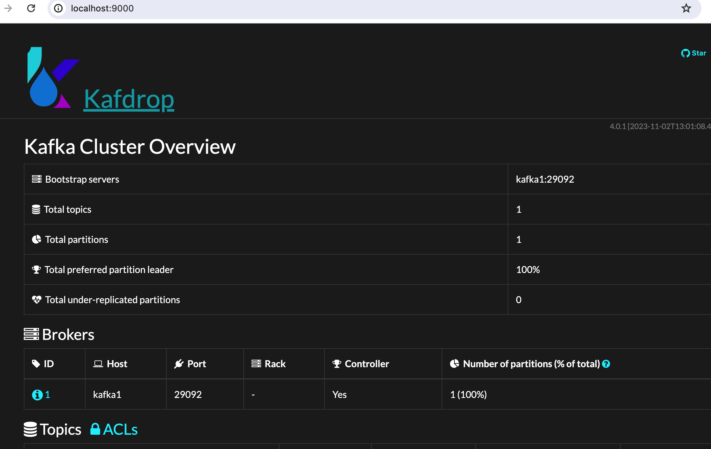

## kafka
kafka做为一款高并发、高可用、高性能的消息系统,非常适合用于拥有大量数据的消息队列、日志聚合、网络活动追踪等场景。有必要掌握，本文将主要从它的常用概念、go中如何使用两方面介绍。

让我们一起开始吧！

### 1. 是什么？
它是一个高性能的消息系统，那什么是消息系统呢？本质上就是一个中间件，在消息的发送和处理之间多加了一层而已，看图比较好理解。


简单描述就是，生产者产生消息交给kafka,消费者从kafka中间层这里获取消息从而进行消费。

那么你可能会问，这么做有什么好处？为啥非得中间加一个kafka层呢？
主要有两个作用：
1. **解耦**
  > 比如用于注册成功后，需要给用户发送邮件;如果用户注册的同时还需要处理给用户发送邮件等其它繁琐操作，一来代码会非常混乱（耦合太高）、二来接口流程会特别长（都放到一个接口里处理，响应会很慢）
2. **缓冲（销峰平谷）**
  > 比如电商网站，遇到促销搞活动这种流量都会很高，而我们服务器的处理能力是有限的，如果把整个消息的消费都放在一起处理，会拖慢整个服务；我们常用的做法是，把一些耗时操作可以放到消息队列中，服务器按自己的节奏去处理消息，不致于一瞬间压垮服务器。

### 2. 和传统消息系统（如RabbitMQ、ActiveMQ）有什么区别？
前面我们已经对kafka的消息队列功能有了基本的了解，那么我们为啥要用它作为消息队列，而不是其它的消息队列呢？这里我们做一个简单比较。

特性 | kafka  | 表头RabbitMQ | ActiveMQ
------| -------| ----- | ----
单机性能 | 高吞吐（每秒可达10w级别）、低延时ms级别|吞吐万级| 吞吐万级性能介于kafka和RabbitMQ之间
适用场景 |大量数据|小、中型数据量| 中型企业级集成
扩展性 | 非常好，本身就是分布式、分区的 |扩展比较复杂 | 良好
可用性 | 非常高 | 高| 高

它的**核心优点在于，高性能、高吞吐，如果你的系统对性能有很高的要求，可以选择它，它的缺点是：相对复杂，提供的核心功能不如传统消息系统多**。

### 3. 概念（术语）
#### 3.1 初识
在kafka中有些专业概念您需要掌握，掌握它们有助于你理解它的整体运转逻辑，我们开始吧！

1. **broker**
  一个kafka服务就是一个broker，可以简单的理解为它就是一台服务器。一个kafak集群由多个broker组成
2. **topic**
  由于消息很多，我们对消息进行分类，这个分类叫topic，比如订单的消息我们可以建一个order的topic,用户的消息我们创建一个叫user的topic
3. **partition**
  kafka是分布式的，支持分区，分区位于topic之下，一个topic下可以有很多分区。
  kafka是分布式的分区可以分布在同步的broker上，另外**分区是主从结构，一个partition有一个分区是leader,然后其它是follower**，可以有多个follower，leader用于处理消息，follower只是消息的备份，follower一般位于不同的broker上，这样可以保证即使一个broker挂掉，还有其它的follower可用。

现在我们画图看看，这样比较清楚。


#### 3.2 完整
4. **Record**
   最基本的消息单元，一条消息也就是一个Record。消息是按照批次写入kafka的

5. **producer**
   生产者-创建/发布消息
6. **consumer**
   消费者-消费处理消息,消费者有一个消费者组的概念，多个消费者组合起来就是一个消费者组。

   **一个消费者组中的不同消费者，分别去消费不同的partition，不可消费相同的分区；但是不同消费者组中的消费者，可以消费同一个分区**。

那么完整的运行过程是怎样的呢？


### 4. 在go中怎么用？
#### 4.1 搭建kafka服务
kafka是分布式的依赖于zookeeper做服务管理,所以我们在搭建kafka时也必须启动zookeeper服务，你可以单独下载zookeeper和kafka进行安装。但是我更推荐你使用docker安装，这样会非常方便，如果你还不会docker，可以去看[这篇](https://juejin.cn/post/7359402386605588490)。

好啦！我们采用`docker compose`的方式启动`zookeeper`和`kafka`

本地新增一个文件`kafka-docker-compose.yml`文件，内容如下：
```yml
version: '2'
services:

  zookeeper:
    image: confluentinc/cp-zookeeper:latest
    environment:
      ZOOKEEPER_CLIENT_PORT: 2181
      ZOOKEEPER_TICK_TIME: 2000

  kafka1:
    image: confluentinc/cp-kafka:latest
    depends_on:
      - zookeeper
    ports:
      - 9092:9092
    environment:
      KAFKA_BROKER_ID: 1
      KAFKA_ZOOKEEPER_CONNECT: zookeeper:2181
      KAFKA_LISTENERS: INTERNAL://:29092,EXTERNAL://:9092
      # 必须要有KAFKA_ADVERTISED_LISTENERS
      # 注意这里的kafka1是服务名称 不能随意写成其它的
      # 定义的是其它docker服务如何联系上这个服务
      KAFKA_ADVERTISED_LISTENERS: INTERNAL://kafka1:29092,EXTERNAL://localhost:9092
      KAFKA_LISTENER_SECURITY_PROTOCOL_MAP: INTERNAL:PLAINTEXT,EXTERNAL:PLAINTEXT
      KAFKA_INTER_BROKER_LISTENER_NAME: INTERNAL
      KAFKA_OFFSETS_TOPIC_REPLICATION_FACTOR: 1 # 副本因子

  kafdrop:  # 定义一个名为 kafdrop 的服务用于UI界面
    image: obsidiandynamics/kafdrop  # 使用 obsidiandynamics/kafdrop 镜像来运行服务
    restart: "no"  # 定义在出现问题时不自动重启服务
    ports:  # 定义服务端口映射
      - "9000:9000"  # 将宿主机的 9000 端口映射到容器的 9000 端口
    environment:  # 设置环境变量
      KAFKA_BROKERCONNECT: "kafka1:29092"  # 指定 Kafka 服务器的连接信息
    depends_on:  # 定义服务间的依赖关系
      - "kafka1"  # kafdrop 服务依赖于 kafka 服务服务依赖于 kafka 服务
```
可以看到这里除了定义了zookeeper和kafka外，还额外加了一个服务`kafdrop`它提供了一个kafka的可视化UI界面，方便我们查看。

通过`docker compose -f kafka-docker-compose.yml up`即可启动服务。

启动成功，通过浏览器`http://localhost:9000`可以看到们的kafka可视化界面如下。



PS：如果启动时，镜像不好拉取，可能需要开启代理。

#### 4.2 生产者
服务已启动，我们开始连接我们的kafka服务吧，前面我们在启动时定义了9092端口，直接连接就行。我们开始编写生产者代码。

```go
package main

import (
	"fmt"
	"log"

	"github.com/IBM/sarama"
)

func main() {
	// 创建 Kafka 同步生产者
	config := sarama.NewConfig()
	config.Producer.RequiredAcks = sarama.WaitForAll
	config.Producer.Partitioner = sarama.NewRandomPartitioner
	config.Producer.Return.Successes = true

	producer, err := sarama.NewSyncProducer([]string{"localhost:9092"}, config)
	if err != nil {
		log.Fatalln("Failed to create producer:", err)
	}
	defer producer.Close()

	// 发布消息
	msg := &sarama.ProducerMessage{
		Topic: "my-topic",
		Value: sarama.StringEncoder("Hello, Kafka!"),
	}

	// 发送消息后返回分区和偏移量
	partition, offset, err := producer.SendMessage(msg)
	if err != nil {
		log.Fatalln("Failed to send message:", err)
	}
	fmt.Printf("Message sent to partition %d at offset %d\n", partition, offset)
}
```

### 4.3 消费者
```go
package main

import (
	"fmt"
	"log"

	"github.com/IBM/sarama"
)

func main() {
	// 创建 Kafka 消费者
	config := sarama.NewConfig()
	config.Consumer.Return.Errors = true

	consumer, err := sarama.NewConsumer([]string{"localhost:9092"}, config)
	if err != nil {
		log.Fatalln("Failed to create consumer:", err)
	}
	defer consumer.Close()

	// 从 "my-topic" 主题中消费消息
	partitionConsumer, err := consumer.ConsumePartition("my-topic", 0, sarama.OffsetNewest)
	if err != nil {
		log.Fatalln("Failed to start partition consumer:", err)
	}
	defer partitionConsumer.Close()

	// 循环接收消息
	for msg := range partitionConsumer.Messages() {
		fmt.Printf("Received message: %s\n", string(msg.Value))
	}
}
```

先启动消费者后，再启动生产者将看到日志消息`Received message: Hello, Kafka!`

好啦！看到这里我们的kafkaf服务已经可以正常跑起来了，在实际项目中，往往还需要进行一些封装才能再次使用，您可以在此基础上进一步探索。

### 5. 一些问题
在刚开始了解kafka时你可能有些问题不太清楚，这里列出一些，供您参考。

#### 5.1为什么kafka非常快？
1. 顺序写入
   以顺序写入磁盘方式进行，避免磁盘的寻址开销
2. 零拷贝技术
   在网络传输数据时，直接从内核态将数据传输到网络通道（减少用户态的中间环节），利用操作系统的`sendfile`系统调用。
3. 批量写入
   生产者将多条消息批量发送到broker,减少网络开销
4. 数据压缩

#### 5.2 kafka如何保证高可用性？
1. 副本机制
   每一个partition都不是单独的，由一个leader和多个follower（副本）组成,leader宕机，会从follower中选择新的leader
2. 分区机制
  partition的多个副本是位于不同broker上，分散存储的（鸡蛋不放在同一个篮子里），某一个broker宕机不会影响整服务
3. 同步机制
  leader会自动向它的follower做同步保持数据的一致
4. offset机制
  每个消费者在消费时都会有一个偏移量（`offset`）的记录，它记录了当前消费到哪里了。消费者宕机后，重启后可以继续从之前的消费点消费。
5. 控制器高可用
  集群中会有一个控制器掌管所有分区和副本的状态，如果控制器宕机后，zookeeper会重新选择新的控制器

#### 5.3 如何提高Kafka的吞吐量？有哪些关键的配置参数？
这里有一个大体原则，围绕提高生产者的生产能力、消费者的消费力、broker的处理能力展开。

1. 生产者
   - 提高批处理大小（batch.size）
   - 使用压缩（compression.type）
   - 提高缓冲区大小（buffer.memory）
2. 消费者
  - 提高单次轮询获取消费者条数(max.poll.records)
  - 提高单次拉取数据量大小（fetch.max.bytes）
3. broker
  - 适当增大分区数，分区是消费者数量的3-5倍（num.partitions）


   


