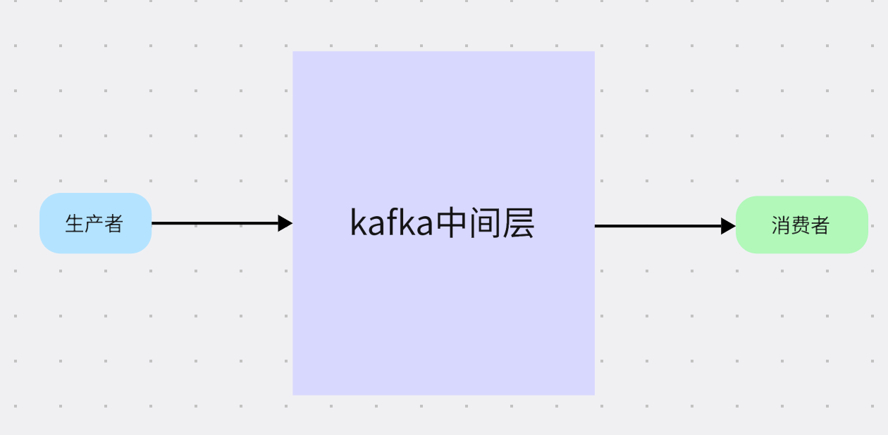
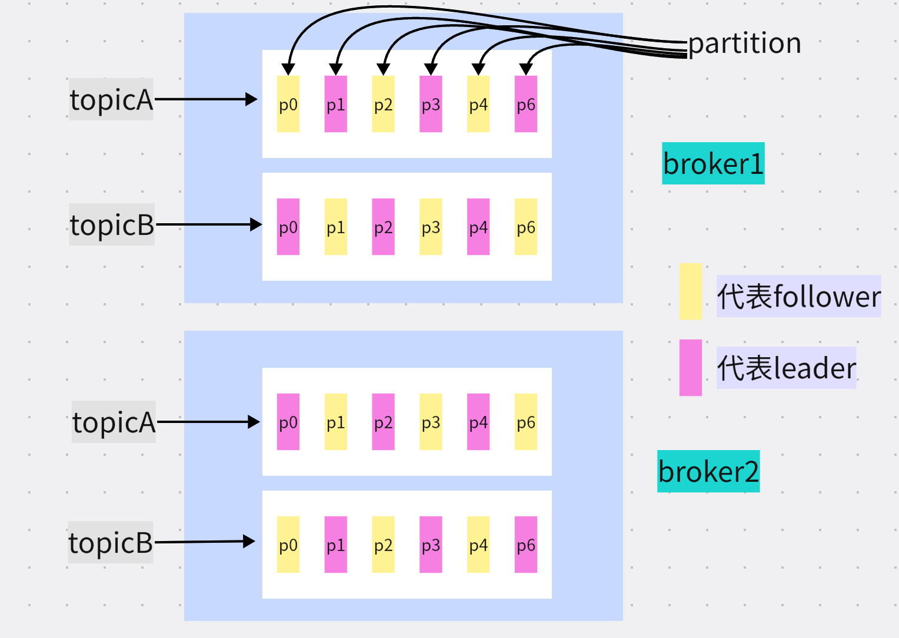
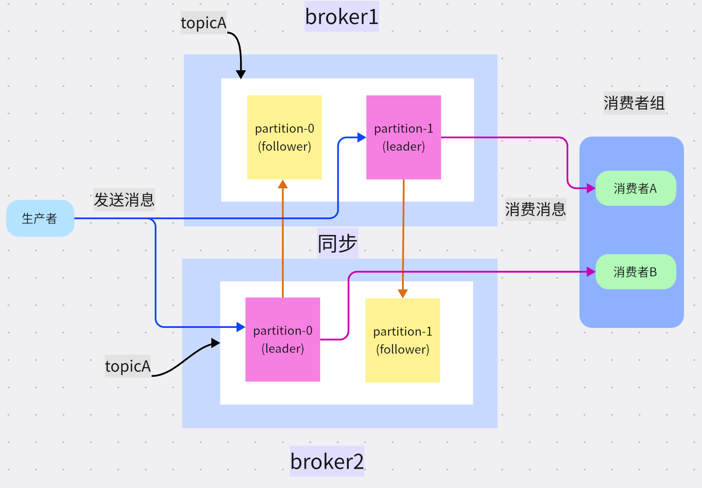

## kafka
kafka做为一款高并发、高可用、高性能的消息系统,非常适合用于拥有大量数据的消息队列、日志聚合、网络活动追踪等场景。有必要掌握，本文将主要从它的常用概念、go中如何使用两方面介绍。

让我们一起开始吧！

### 1. 是什么？
它是一个高性能的消息系统，那什么是消息系统呢？本质上就是一个中间件，在消息的发送和处理之间多加了一层而已，看图比较好理解。

简单描述就是，生产者产生消息交给kafka,消费者从kafka中间层这里获取消息从而进行消费。

那么你可能会问，这么做有什么好处？为啥非得中间加一个kafka层呢？
主要有两个作用：
1. **解耦**
  > 比如用于注册成功后，需要给用户发送邮件;如果用户注册的同时还需要处理给用户发送邮件等其它繁琐操作，一来代码会非常混乱（耦合太高）、二来接口流程会特别长（都放到一个接口里处理，响应会很慢）
2. **缓冲（销峰平谷）**
  > 比如电商网站，遇到促销搞活动这种流量都会很高，而我们服务器的处理能力是有限的，如果把整个消息的消费都放在一起处理，会拖慢整个服务；我们常用的做法是，把一些耗时操作可以放到消息队列中，服务器按自己的节奏去处理消息，不致于一瞬间压垮服务器。

### 2. 和传统消息系统（如RabbitMQ、ActiveMQ）有什么区别？
前面我们已经对kafka的消息队列功能有了基本的了解，那么我们为啥要用它作为消息队列，而不是其它的消息队列呢？这里我们做一个简单比较。

特性 | kafka  | 表头RabbitMQ | ActiveMQ
------| -------| ----- | ----
单机性能 | 高吞吐（每秒可达10w级别）、低延时ms级别|吞吐万级| 吞吐万级性能介于kafka和RabbitMQ之间
适用场景 |大量数据|小、中型数据量| 中型企业级集成
扩展性 | 非常好，本身就是分布式、分区的 |扩展比较复杂 | 良好
可用性 | 非常高 | 高| 高

它的**核心优点在于，高性能、高吞吐，如果你的系统对性能有很高的要求，可以选择它，它的缺点是：相对复杂，提供的核心功能不如传统消息系统多**。

### 3. 概念（术语）
#### 3.1 初识
在kafka中有些专业概念您需要掌握，掌握它们有助于你理解它的整体运转逻辑，我们开始吧！

1. **broker**
  一个kafka服务就是一个broker，可以简单的理解为它就是一台服务器。一个kafak集群由多个broker组成
2. **topic**
  由于消息很多，我们对消息进行分类，这个分类叫topic，比如订单的消息我们可以建一个order的topic,用户的消息我们创建一个叫user的topic
3. **partition**
  kafka是分布式的，支持分区，分区位于topic之下，一个topic下可以有很多分区。
  kafka是分布式的分区可以分布在同步的broker上，另外**分区是主从结构，一个partition有一个分区是leader,然后其它是follower**，可以有多个follower，leader用于处理消息，follower只是消息的备份，follower一般位于不同的broker上，这样可以保证即使一个broker挂掉，还有其它的follower可用。

现在我们画图看看，这样比较清楚。

#### 3.2 完整
4. **Record**
   最基本的消息单元，一条消息也就是一个Record。消息是按照批次写入kafka的

5. **producer**
   生产者-创建/发布消息
6. **consumer**
   消费者-消费处理消息,消费者有一个消费者组的概念，多个消费者组合起来就是一个消费者组。

   **一个消费者组中的不同消费者，分别去消费不同的partition，不可消费相同的分区；但是不同消费者组中的消费者，可以消费同一个分区**。

那么完整的运行过程是怎样的呢？

### 4. 在go中怎么用？
#### 4.1 搭建kafka服务
#### 4.2 生产者
### 4.3 消费者

### 5. 一些问题

