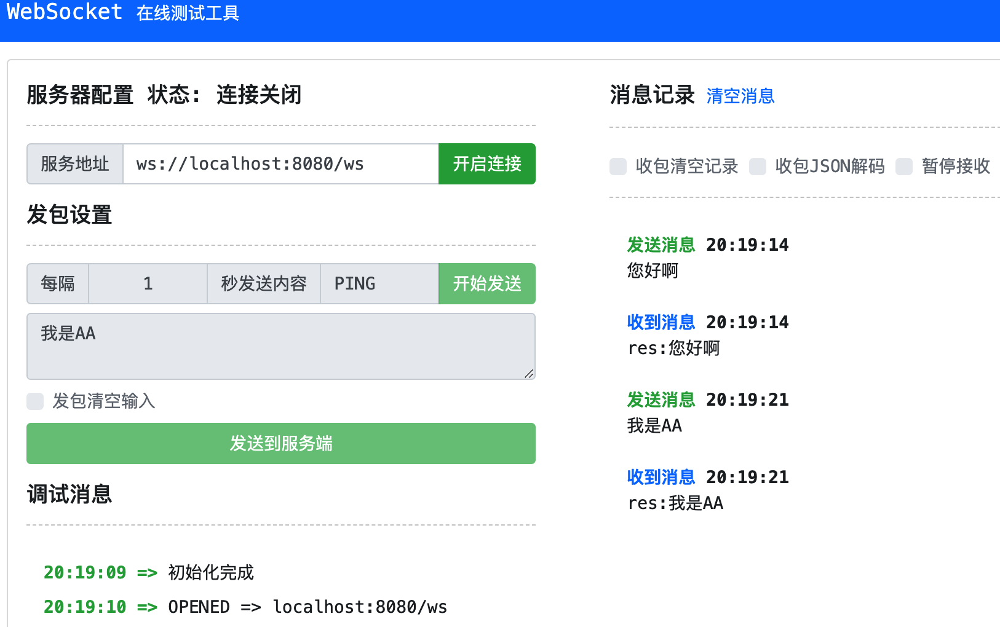

## websocket
在实时通信的场景中,由于http协议协议是单向的,服务器无法主动要客户端推送消息，客户端只能使用轮询的方式不断请求服务器，非常浪费服务器资源。为此我们需要一种全双工的协议，websocket应运而生。

在go中websocket的使用也很简单，我们可以引入`gorilla/websocket`包轻松构建，这个包非常受欢迎，有很高的stars数，我们一起学习下。

### 1. 什么是websocket
在开始之前我们要先了解下websocket是什么？

这里简单介绍下，**`websocket`是一种全双工的协议**，啥叫全双工，也就是客户端可以发送消息给服务器，服务器也可以发送消息给客户端。

这非常有用，比如我们想做一个聊天室，客户端可以发送消息给服务器，服务器可以发送消息给客户端。又比如你热爱炒股，你希望在页面上看到股票价格的实时变动，也可以用websocket来实现。**它主要用于实时性要求较高的场景**。

websocket它的原理是，**客户端通过发送一个握手的`http`请求，在请求头中带上下面的头信息**：
1. `Connection: Upgrade`
2. `Upgrade: websocket`
3. `Sec-WebSocket-Key: 一个随机的key`
**表明这是一个websocket请求，服务端完成升级后，就可以建立一个持久化的websocket连接，然后就可以双向通行了**。

由于建立了持久连接后，无需重复去建立连接，所以**通信时开销非常小，性能好**。

另外它**底层使用`tcp`传输协议，所以它的消息是可靠的**，不会丢消息。

建立连接后如何判断对方（客户端/服务端）仍然在线呢？
主要是**通过发送心跳包**来判断，通过定时发送心跳包（ping），如果对方响应心跳包（pong），则说明对方在线。

理论部分差不多了，我们动手来操作吧！

### 2. 最简单的demo
我们先来实现一个最简单的demo，实现一个ws连接后双向发送消息
```go
// main.go
package main

import (
	"log"
	"net/http"

	"github.com/gorilla/websocket"
)

// 用于升级
var upgrader = websocket.Upgrader{CheckOrigin: func(r *http.Request) bool {
	return true // 允许跨域
}}

func serveHome(w http.ResponseWriter, r *http.Request) {
	// 2. 对http请求升级为websocket
	ws, err := upgrader.Upgrade(w, r, nil)
	if err != nil {
		log.Println(err)
		return
	}
	defer ws.Close()
	log.Println("连接成功")
	// 3. 利用返回的websocket连接进行读写操作
	for {
		// 这里message是[]byte类型
		_, message, err := ws.ReadMessage()
		if err != nil {
			log.Println("接收信息发生错误：", err)
			return
		}
		log.Printf("recv: %s", message)
		resMsg := append([]byte("res:"), message...)
		err = ws.WriteMessage(websocket.TextMessage, resMsg)
		if err != nil {
			log.Println("写信息发生错误：", err)
			return
		}
	}
}

func main() {
	// 1. 用http处理请求
	http.HandleFunc("/ws", serveHome)
	log.Println("server startup at 127.0.0.1:8080")
	log.Fatal(http.ListenAndServe("127.0.0.1:8080", nil))
}
```

在终端执行`go run main.go`,然后用浏览器打开[websocket测试工具](https://wstool.js.org/),在服务器地址栏输入`ws://localhost:8080/ws`，开启连接，连接成功后即可发生信息。



终端信息如下：
```shell
2024/06/22 20:18:58 server startup at 127.0.0.1:8080
2024/06/22 20:19:10 连接成功
2024/06/22 20:19:14 recv: 您好啊
2024/06/22 20:19:21 recv: 我是AA
```

此时我们已经实现了一个简单的websocket双向通信功能，可以发现websocket的使用总体分成三步：
1. 借用http处理请求
2. 升级请求为websocket连接
3. 利用返回的websocket连接发送和接收信息

### 3. 一个聊天服务器demo
虽然上面我们通过websocket实现了简单的双向通信，但是实际这上没有什么用 —— 每次回复的消息都只是回显信息而已；我们能否实现一个真正可以聊天的demo呢？

我们来分析下，上面我们已经能做到双向通信了，只是需要解决收到一个消息后推送给其他客户端的问题，而这个问题需要解决两点：
1. 服务器要能区分不同的客户端
2. 当收到消息后，需要能知道转发给哪个客户端

第一点很容易解决，我们只需要给每个客户端分配一个唯一的id即可，然后通过id来区分客户端。第二点，我们可以约定一个消息格式，比如：`id:msg`,这样收到消息后就知道转发给哪个客户端。

#### 1. 初步实现聊天
下面看具体代码实现
```go
// mian.go
package main

import (
	"log"
	"net/http"
	"strconv"
	"strings"

	"github.com/gorilla/websocket"
)

var (
	// 全局连接 id - conn 用于区分不同客户端
	globleConn = make(map[int16](*websocket.Conn))
	// 当前最大id
	maxKey int16 = 1

	upgrader = websocket.Upgrader{CheckOrigin: func(r *http.Request) bool {
		return true // 允许跨域
	}}
)

func serveHome(w http.ResponseWriter, r *http.Request) {
	ws, err := upgrader.Upgrade(w, r, nil)
	if err != nil {
		log.Println(err)
		return
	}
	defer ws.Close()
	addGlobalConn(ws)

	for {
		_, message, err := ws.ReadMessage()
		if err != nil {
			log.Println("接收信息发生错误：", err)
			return
		}
		log.Printf("recv: %s", message)
		// 解析出要发送的客户端
		conn, msg := parseMessage(message)
		if conn != nil {
			pushMessage(conn, msg)
		}
	}
}

// 记录conn到GlobalConn
func addGlobalConn(ws *websocket.Conn) {
	globleConn[int16(maxKey)] = ws
	log.Printf("======编号：%d连接加入成功", maxKey)
	maxKey += 1
}

// 客户端消息解析出id和消息
// 返回conn 和 消息
func parseMessage(message []byte) (*websocket.Conn, string) {
	// 假设消息格式为 "receiver:message"
	messageParts := strings.SplitN(string(message), ":", 2)
	if len(messageParts) != 2 {
		return nil, ""
	} else {
		receiverId, err := strconv.ParseInt(messageParts[0], 10, 16)
		if err != nil {
			log.Println("转换id发生错误:", err)
			return nil, ""
		}

		if globleConn[int16(receiverId)] != nil {
			return globleConn[int16(receiverId)], messageParts[1]
		} else {
			return nil, ""
		}
	}
}

// 推送消息到客户端
func pushMessage(ws *websocket.Conn, message string) {
	err := ws.WriteMessage(websocket.TextMessage, []byte(message))
	if err != nil {
		log.Println("write:", err)
	}
	log.Printf("send: %s成功", message)
}

func main() {
	http.HandleFunc("/ws", serveHome)
	log.Println("server startup at 127.0.0.1:8080")
	log.Fatal(http.ListenAndServe("127.0.0.1:8080", nil))
}
```
运行起后，打开上面的websocket工具，分别打开两个连接，通过`id:msg`格式发送消息，即可看到效果。可自行测试，下面给出终端效果：
```shell
2024/06/22 21:37:42 server startup at 127.0.0.1:8080
2024/06/22 21:37:54 ======编号：1连接加入成功
2024/06/22 21:38:08 ======编号：2连接加入成功
2024/06/22 21:38:20 recv: 1:您好啊
2024/06/22 21:38:20 send: 您好啊成功
2024/06/22 21:38:29 recv: 2:这里来吧
2024/06/22 21:38:29 send: 这里来吧成功
```

#### 2. 心跳检测优化
上面的代码我们是通过在循环中读取消息，如果读取消息时发生错误，则退出循环，从而终止连接。但是这样的设计存在一个问题，如果临时网络问题导致读取失败，则整个连接都会断开，这显然是不合理的。因此，我们改用心跳检测，设定一个最大的失败次数，如果达到最大失败次数才关闭连接。

心跳检测的部分我们可以放到一个goroutine中处理，通过通道实现关闭的通信，代码如下：
```go
package main

import (
	"log"
	"net/http"
	"strconv"
	"strings"
	"time"

	"github.com/gorilla/websocket"
)

var (
	upgrader = websocket.Upgrader{CheckOrigin: func(r *http.Request) bool {
		return true // 允许跨域
	}}

	// 全局连接 id - conn 用于区分不同客户端
	globleConn = make(map[int16](*websocket.Conn))
	// 当前最大id
	maxKey int16 = 1

	// 心跳最大失败次数
	heartbeatMaxFailTimes = 3
)

func serveHome(w http.ResponseWriter, r *http.Request) {
	ws, err := upgrader.Upgrade(w, r, nil)
	if err != nil {
		log.Println(err)
		return
	}
	defer ws.Close()
	// 退出优化下 要更新全局连接
	defer func() {
		key := getConnId(ws)
		if key != -1 {
			delete(globleConn, key)
			log.Printf("======编号：%d连接退出", key)
		}
	}()

	addGlobalConn(ws)
	// ws是否停止信号
	done := make(chan struct{})
	go sendHeartbeat(ws, done)
	dealWs(ws, done)
}

// 抽出处理ws函数
func dealWs(ws *websocket.Conn, done chan struct{}) {
	for {
		select {
		case <-done:
			log.Printf("%d号 dealWs 收到停止信号，退出", getConnId(ws))
			return
		default:
			_, message, err := ws.ReadMessage()
			if err != nil {
				log.Printf("%d号 读取发生错误%s:", getConnId(ws), err)
				time.Sleep(5 * time.Second) // 1秒 重新读取看
				continue
			}
			log.Printf("recv: %s", message)

			conn, msg := parseMessage(message)
			if conn != nil {
				pushMessage(conn, msg)
			}
		}
	}
}

// 发送心跳
func sendHeartbeat(ws *websocket.Conn, done chan struct{}) {
	ticker := time.NewTicker(5 * time.Second) // 发送一次心跳
	defer ticker.Stop()
	// 心跳发送失败次数
	failTimes := 0
	wsId := getConnId(ws)

	for {
		select {
		case <-done: // 收到停止信号，关闭ticker并退出
			log.Printf("%d号 心跳收到停止信号,停止发送心跳", wsId)
			return
		case <-ticker.C: // 每隔ticker.C时间发送一次心跳
			err := ws.WriteControl(websocket.PingMessage, []byte{}, time.Now().Add(time.Second))

			if err != nil {
				log.Printf("%d号 心跳发送失败: %v", wsId, err)
				failTimes += 1

				if failTimes >= heartbeatMaxFailTimes {
					log.Printf("%d号 心跳失败次数达到最大值（%d次）停止发送心跳，发送取消信号", wsId, heartbeatMaxFailTimes)
					close(done) // 直接close
					return
				}
			} else {
				// 如果成功则重置为0
				failTimes = 0
				log.Printf("%d号 发送心跳成功", wsId)
			}
		}
	}
}

// 查找conn的id
func getConnId(ws *websocket.Conn) int16 {
	for key, conn := range globleConn {
		if conn == ws { // 这里比较的是指针
			return key
		}
	}
	return -1
}

// 记录conn到GlobalConn
func addGlobalConn(ws *websocket.Conn) {
	globleConn[int16(maxKey)] = ws
	log.Printf("======编号：%d连接加入成功", maxKey)
	maxKey += 1
}

// 客户端消息解析出id和消息
// 返回conn 和 消息
func parseMessage(message []byte) (*websocket.Conn, string) {
	// 假设消息格式为 "receiver:message"
	messageParts := strings.SplitN(string(message), ":", 2)
	if len(messageParts) != 2 {
		return nil, ""
	} else {
		receiverId, err := strconv.ParseInt(messageParts[0], 10, 16)
		if err != nil {
			log.Println("转换id发生错误:", err)
			return nil, ""
		}

		if globleConn[int16(receiverId)] != nil {
			return globleConn[int16(receiverId)], messageParts[1]
		} else {
			return nil, ""
		}
	}
}

// 推送消息到客户端
func pushMessage(ws *websocket.Conn, message string) {
	err := ws.WriteMessage(websocket.TextMessage, []byte(message))
	if err != nil {
		log.Println("write:", err)
	}
	log.Printf("send: %s成功", message)
}

func main() {
	http.HandleFunc("/ws", serveHome)
	log.Println("server startup at 127.0.0.1:8080")
	log.Fatal(http.ListenAndServe("127.0.0.1:8080", nil))
}
```

我们优化后再运行测试，下面是终端测试结果
```shell
2024/06/22 22:46:52 server startup at 127.0.0.1:8080
2024/06/22 22:47:05 ======编号：1连接加入成功
2024/06/22 22:47:07 ======编号：2连接加入成功
2024/06/22 22:47:10 1号 发送心跳成功
2024/06/22 22:47:12 2号 发送心跳成功
2024/06/22 22:47:15 1号 发送心跳成功
2024/06/22 22:47:17 2号 发送心跳成功
2024/06/22 22:47:19 recv: 2:2号你好 我是1号
2024/06/22 22:47:19 send: 2号你好 我是1号成功
2024/06/22 22:47:20 1号 发送心跳成功
2024/06/22 22:47:22 2号 发送心跳成功
2024/06/22 22:47:25 1号 发送心跳成功
2024/06/22 22:47:27 2号 发送心跳成功
2024/06/22 22:47:30 1号 发送心跳成功
2024/06/22 22:47:30 recv: 1:1号我收到了你的消息
2024/06/22 22:47:30 send: 1号我收到了你的消息成功
2024/06/22 22:47:32 2号 发送心跳成功
2024/06/22 22:47:35 1号 发送心跳成功
2024/06/22 22:47:37 2号 发送心跳成功
2024/06/22 22:47:38 recv: 2:我们聊聊吧
2024/06/22 22:47:38 send: 我们聊聊吧成功
2024/06/22 22:47:40 1号 发送心跳成功
2024/06/22 22:47:42 2号 发送心跳成功
2024/06/22 22:47:45 recv: 1:好呀
2024/06/22 22:47:45 send: 好呀成功
2024/06/22 22:47:45 1号 发送心跳成功
2024/06/22 22:47:47 2号 发送心跳成功
2024/06/22 22:47:49 1号 读取发生错误websocket: close 1000 (normal): Active closure of the user:
2024/06/22 22:47:50 1号 心跳发送失败: websocket: close sent
2024/06/22 22:47:52 2号 发送心跳成功
2024/06/22 22:47:54 1号 读取发生错误websocket: close 1000 (normal): Active closure of the user:
2024/06/22 22:47:55 1号 心跳发送失败: websocket: close sent
2024/06/22 22:47:57 2号 发送心跳成功
2024/06/22 22:47:59 1号 读取发生错误websocket: close 1000 (normal): Active closure of the user:
2024/06/22 22:48:00 1号 心跳发送失败: websocket: close sent
2024/06/22 22:48:00 1号 心跳失败次数达到最大值（3次）停止发送心跳，发送取消信号
2024/06/22 22:48:02 2号 发送心跳成功
```

### 4. 最后
上面的代码只是一个基本的实现，并不完善，还有许多地方要优化；考虑到篇幅和入门使用的原因，没有必要面面俱到，希望能起到抛砖引玉的作用供大家参考。


