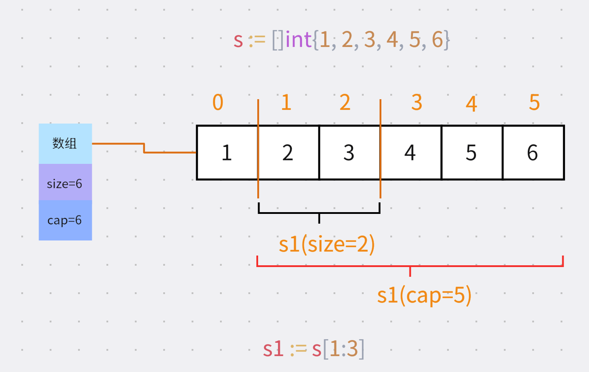

## slice
slice作为go关键的数据结构之一,必须熟练掌握;slice看起来非常简单，但是使用过程中有非常多的细节要注意,不信，我们先来看一段代码：

```go
func main() {
	a := []int{1, 2, 3}
	slice(a)
	fmt.Println("1", a)
	slicePtr1(&a)

	fmt.Println("2", a)
}

func slice(s []int) {
	s[0] = 10
	s = append(s, 10)
	s[1] = 10
}

func slicePtr1(s *[]int) {
	(*s)[0] = 20
	*s = append(*s, 20)
	(*s)[1] = 20
}
```

暂停5分钟思考一下，答案如下：
```
1 [10 2 3]
2 [20 20 3 20]
```
如果你能轻易的得出正确答案，那么证明你已熟练掌握了slice，可以跳过此文啦！

### 1. 底层实现
slice底层是一个结构体
```go
type Slice struct {
	Data unsafe.Pointer // 数组指针
	Len  int // 长度
	Cap  int // 容量
}
```
三个字段,这里着重注意它有一个**底层数组**，之所以在许多时候我们容易搞混都是因为对底层数组的理解没到位。

另外对于初学者而言，困惑之一是长度和容量的区别：
1. **长度 - 实际元素的数量**
2. **容量 - 在不扩容的情况下,最多能放置的元素数量**

### 2. slice和array区别
1. slice被称为**动态数组**，因此它的元素个数可以随意增加，但在数组中元素个数是定时的。
2. slice是引用类型而数组是非引用类型，传递slice可能会改变原始slice值
3. slice的底层是数组

在go中使用slice的场景比array多的多。

### 3. 初始化
初始化一个切片非常简单
```go
// 方式1 make（常用）
s := make([]int, 10, 20) // 长度10、容量20
// 方式2 字面量
s := []int{1,2,3,4,5}

// 方式3 截取
var a = [...]int{1, 2, 3, 4, 5}
s := a[1:3]
s1 := s[2:3]
```

### 4. append插入元素
append功效是在slice尾部追加一个元素,简单吧！非常简单，这样使用即可
```go
s := make([]int, 10, 20 )
// 插入一个元素12
s = append(s, 12)
// 插入多个元素
s = append(s, 12, 23)
```

需要注意的是append，必须要有接收者，直接这样写`append(s,12)`是不行的。它返回的是slice，我们的标准用法是append s，则用s来接收返回值。

#### 4.1 append触发扩容
你以为append就这点东西么？No,append还有个重要的知识点没说——扩容！
append时，如果cap不够会发生扩容：

1. 如果容量够,不扩容，底层数组还是还是原来的那个
2. 如果容量不够，扩容，创建新的底层数组

看一段代码,append触发扩容后底层数组改变，地址改变
```go
package main

import "fmt"

func main() {
	s := make([]int, 5)

	fmt.Printf("s append前地址%p\n", s)
	s = append(s, 1) // 此前容量=size=5 触发了扩容，导致底层数组改变
	fmt.Printf("s append后地址%p\n", s)

	s1 := make([]int, 5, 10)
	fmt.Printf("s1 append前地址%p\n", s1)
	s1 = append(s1, 1)
	fmt.Printf("s1 append后地址%p\n", s1)
}

// s append前地址0xc00001a1b0
// s append后地址0xc0000260a0
// s1 append前地址0xc0000260f0
// s1 append后地址0xc0000260f0
```

#### 4.2 append后的切片可能改变原切片中值
如果append后的切片，和原切片共享的是同一个底层数组（未扩容）则修改新切片会导致原切片元素改动，有了前面内容的铺垫，这点应该很好理解。

看代码
```go
func main() {
	s := make([]int, 5, 10)
	// 不触发扩容 底层数组未变
	s1 := append(s, 1)
	s1[1] = 22 // s同时被修改
	s1[2] = 33
	fmt.Println("s=", s)
	fmt.Println("s1=", s1)
}

// s= [0 22 33 0 0]
// s1= [0 22 33 0 0 1]
```

### 5. 截取（切片）
截取即从slice中截取一段成新的slice,这里主要掌握点：

1. s[2:4] **左闭右包含，代表区间为[2,4)**
2. s[2:4:5] 最后一位用于限度**容量为5-2=3**
3. 其它**缺省情况为默认值**，比如`s[:4]`起始索引为0
4. 为**同一个底层数组**
5. 新容量默认为,**起始索引到底层数组末尾**

代码演示
```go
package main

import "fmt"

func main() {
	s := []int{1, 2, 3, 4, 5, 6} // 容量6

	// 截取索引1，2 不包含索引3
	// 因此size为2，容量为到起始1到最后一个索引的位置即6-1=5
	s1 := s[1:3]
	fmt.Println("s1=", s, "len(s1)=", len(s1), "cap(s1)=", cap(s1))

	s1[0] = 22
	// 底层为同一数组 因此s会改变
	fmt.Println("s=", s)

	s2 := s[2:4:5] // 截取出来后容量为 5-2=3
	fmt.Println("s2=", s2, "len(s2)=", len(s2), "cap(s2)=", cap(s2))
}

// s1= [1 2 3 4 5 6] len(s1)= 2 cap(s1)= 5
// s= [1 22 3 4 5 6]
// s2= [3 4] len(s2)= 2 cap(s2)= 3
```

截取图示：


### 6. copy复制
1. copy的元素个数以最少的slice为准
2. copy(s1, s2) s2复制到s1
```go
func main() {
	s1 := []int{1, 2, 3, 4}
	s2 := []int{3, 4, 5, 6, 7, 8}
	copy(s1, s2) // s2复制到s1 此时s1元素个数少于s2,所以复制s1的元素个数
	fmt.Println("s1=", s1)
}

// s1= [3 4 5 6]
```

### 7. 删除指定索引元素
go并没有提供对应的方法，我们是通过截图两个slice然后append来实现的。

```go
func main() {
	s1 := []int{1, 2, 3, 4, 5, 6, 7, 8}

	// 删除索引为2的元素
	s1 = append(s1[:2], s1[3:]...)
	fmt.Println("s1=", s1)
}

// s1= [1 2 4 5 6 7 8]
```

### 8. 遍历
```go
func main() {
	s := []int{1, 2, 3, 4, 5, 6, 7, 8}

	// i - 索引
	// v - 值
	for i, v := range s {
		fmt.Println(i, v)
	}

	// 只需要索引
	for i := range s {
		fmt.Println(i)
	}
}
```

### 9. 回答一开始的问题
现在让我来回答一开始的问题，

一. slice函数
```go
func slice(s []int) {
	s[0] = 10
	s = append(s, 10)
	s[1] = 10
}

// 这里传入的是一个切片，切片是引用类型
// s[0] = 10 由于底层都是同一个数组，因此改动会体现到外层slice上

// s = append(s, 10) 这里首先会发生扩容，因此扩容后返回的s已经和一开始底层s是两个不同的slice,所以后续的s[1] = 10 并不会改变外层slice

// 需要注意的是，即使append的s没有发生扩容，如果单单append，虽然改动的是同一个底层数组，但是外出slice的size和cap都没有改变，其实也不会体现到外层slice
```

二、 slicePtr1函数
```go
func slicePtr1(s *[]int) {
	(*s)[0] = 20
	*s = append(*s, 20)
	(*s)[1] = 20
}

// 这里传递的是切片的指针
// *s解引后相当于在原slice操作
// 因此所有操作都会体现到原slice上

// 从这里也可以看出，传递指针和引用类型在某些时候其实是不能等同的哦
```

