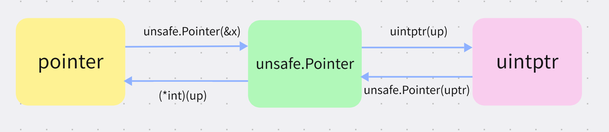

## uintptr
在go语言中，如果你去看源码的话，大概率会碰到`uintptr`,第一次碰到会直接懵掉，这啥玩意，完全不清楚，本次我们一起来学习下。

由于`uintptr`是和指针相关的，它和`unsafe.Pointer`、`普通指针`都有莫大关系，因此我们一步步来，先从普通指针入手，循序渐进。

### 1. 普通指针
我们最熟悉，这里做一个复习。
```go
package main

import "fmt"

func main() {
	var x int = 23

	// 取x变量地址
	xptr := &x
	fmt.Printf("x addr: %p\n", xptr)

	// 改变x地址值
	*xptr = 42
	fmt.Printf("x: %d\n", x)
}
```

### 2. 通用指针unsafe.Pointer
它是通用指针,**`unsafe.Pointer` 可以与任意类型指针相互转换**

```go
package main

import (
	"fmt"
	"unsafe"
)

func main() {
	var x int = 23
	// 取x的指针
	var p *int = &x

	up := unsafe.Pointer(p) // 将 int指针 转换为 unsafe.Pointer
	*(*int)(up) = 100       // 将 unsafe.Pointer 转换为 int 指针 并解引赋值
	fmt.Println(x)          // 输出 100
}
```

### 3. 指针整数uintptr
好啦！经过前面的铺垫，终于到来`uintptr`了,它是指针的整数表示形式。

**它可以和`unsafe.Pointer`相互转换，它的主要用途是做指针运算**。

#### 1. 指针整数表示
```go
package main

import (
	"fmt"
	"unsafe"
)

func main() {
	var x = 35

	p := &x
	up := unsafe.Pointer(p) // 指针 转 unsafe.Pointer
	uptr := uintptr(up)     // unsafe.Pointer 转 uintptr

	fmt.Printf("pointer: %p； 十进制为：%d\n", p, p)
	// pointer: 0xc0000ae008； 十进制为：824634433544
	fmt.Printf("uintptr: %d\n", uptr) // 地址的十进制表示
	// uintptr: 824634433544
}
```

#### 2. 指针运算修改值
```go
package main

import (
	"fmt"
	"unsafe"
)

func main() {
	arr := []int{1, 2, 3, 4, 5}

	// 数组地址的 unsafe.Pointer
	up := unsafe.Pointer(&arr[0])

	// 索引为2 元素地址的 unsafe.Pointer
	// unsafe.Sizeof计算数组元素大小 返回uintptr
	up2 := unsafe.Pointer(uintptr(up) + unsafe.Sizeof(arr[0])*2)
	// 修改元素值
	*(*int)(up2) = 100

	fmt.Printf("修改后的数组为：%#v\n", arr)
	// 修改后的数组为：[]int{1, 2, 100, 4, 5}
}
```

### 4. 三者关系
他们三者之间是什么关系呢？
本质上`unsafe.Pointer`是pointer和`uintptr`之间的桥梁，我们如果需要对指针进行计算等操作需要转换到`uintptr`做操作。操作完后再依次转换回`unsafe.Pointer`、`pointer`.



### 5. 风险与优势
go语言是类型安全的语言，默认情况下不允许对指针做运算操作，但是它还是给我们偷偷留了一道口子——`unsafe.Pointer`,让我们可以对指针做一些操作，但是它不推荐我们这么做，因为存在风险。

那么有哪些风险呢？
1. 类型不安全
通过将任意类型先转换成`unsafe.Pointer`然后再转换成其它指针类型，可能导致**类型不匹配，导致错误**。

2. 内存不安全
`unsafe.Pointer`可能**指向一个无效的内存地址**(一个变量已经被垃圾回收或者内存布局改变)，内存越界等。

既然不安全为啥还要使用呢？
1. 追求极致性能
指针级别直接操作，省去值拷贝和额外内存分配，性能比较高。

2. 与C语言交互（Cgo工具）
3. 操作系统级别调用（直接与操作系统交互）


