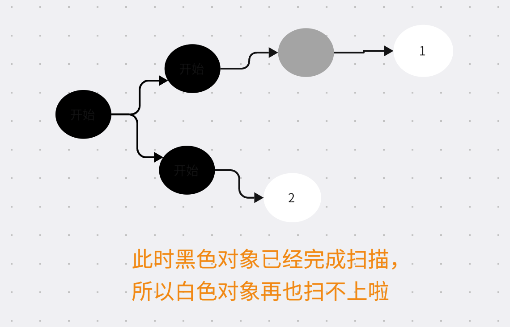
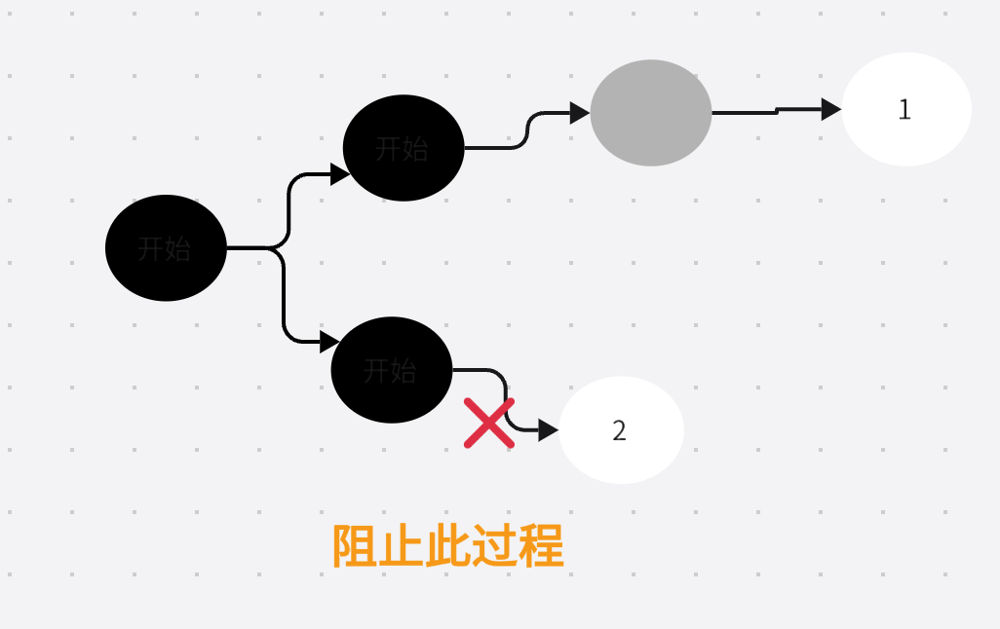

## 垃圾回收GC（Garbage Collection）
### 1. 什么是垃圾回收？
我们知道程序的运行离不开内存的分配,在代码中每分配一个变量，就需要占用一定的大小的内存，不同的类型（比如：int、int8、int32、int64）它们会占用不同大小的内存。

内存就像计算机中的硬通货，大家都需要。但是内存比较昂贵，在这个世界上资源总是有限的，内存也不例外；因此，如果内存只是不断被分配，却没有回收（释放），那么相信很快内存就会被耗尽了。

所以，程序除了需要分配内存外，也需要回收内存。在程序语言中，主要有两种方式：
1. 程序员手动释放（比如C语言）
2. 程序语言自动释放（比如ruby、python、go）

如果内存的释放交由程序员管理，一方面，程序员很可能忘记释放 —— 非常危险；另外一方面，程序员在编写业务代码的时候需要同时考虑内存在什么时候释放 —— 大大加大了编程的负担。

综上，我们是幸运的，go支持自动垃圾回收。

### 2. 原理
垃圾回收有很多种方式，比如引用计数；go主要采用的是标记、清除方式。
很容易理解：
- 标记阶段，通过遍历所有可达对象的方式，标记出活跃对象和非活跃对象（垃圾）
- 清除阶段，清理非活跃对象。

#### 2.1 三色标记
三色标记算法是标记-清除算法的一种改进,go使用它实现的标记、清除。

那么什么是三色标记呢？
三色主要指的是：
1. 白 （初始化状态颜色，代表还未检查）
2. 灰 (中间色，自己已经检查，但是它的引用对象还未检查)
3. 黑 (稳定色，自己已经检查、它的引用也被检查了)

我们可以把零散的内存使用，看做一颗颗珍珠,这些珍珠是被穿起来的，我们只要找到它的线头，然后从线头开始往下不断扫描，就能把所有活跃的内存（串起来的珍珠）全部找出来，那么剩下的就是可以释放的内存了。

三色标记法的作用主要是通过，对上面提到的一颗颗珍珠进行标记上色，用以区分哪些内存可以释放。我们把标记完后颜色仍然是白色的对象,认为是可以释放的对象 —— 它是不可达的，没有任何对象引用它。

三色标记的过程是怎样的，总共有以下几步
1. 一开始所有的对象都是白色
2. 从根路径开始，把这些根路径标记成灰色
3. 不断重复下面的过程
  - 将这个灰色标记为黑色，同时将这个灰色对象引用的白色对象标记灰色
  - 重复上面的这个过程，直至没有灰色对象

三色标记算法，单纯从上面的文字上看还是有点难度的，最好去看看动画过程了解下，应该还是很容易了解的。

[B站视频地址](https://www.bilibili.com/video/BV1KU4y1Y7cu/?vd_source=58d77d223d610aa47a97c9f3acc3bfeb)

#### 2.2 为什么选用三色标记
我们不禁要问go当时为啥选择了三色标记算法呢？主要有下面两点考虑：
1. 可以和应用程序并发执行
2. 拥有较短的暂停（STW）时间

#### 2.2 混合写屏障
已经使用了三色标记为啥还用这个`混合写屏障`呢？

最主要的原因是，三色标记算法有缺点，具体是什么呢？要知道我们的程序和GC过程是并发运行的，因此在标记阶段，对象的引用关系是会发生变化的。

让我们考虑一种情况：
在标记过程中一开始，一个对象此时已经是黑色，而此时引用的变更让一个黑色对象引用到了白色对象，比如：

出现上图的情况，会导致错误的将2号对象（白色）当作垃圾被清除掉；释放了有效使用对象，非常严重，这是不可容忍的。

因此，为了保证并发时标记的准确性，提出了`三色不变性`,对于上面的情况，我的解决办法是，我不允许一个黑色的对象引用白色对象。

好啦！我想你已经猜到啦，混合写屏障的目的是保证并发标记的准确性，维持`三色不变性`。

那么混合写屏障是如何工作的呢？
它会在并发标记期间，引用变动时，自动执行一段代码，以此保证准确性。

### 3. GC处理流程
主要有以下几个阶段
1. 初始化标记阶段
   - 第一次STW(Stop The World),暂停所有goroutine,保证GC准确的识别活跃对象。
   - 标记出所有根对象（全局变量、以及所有goroutine栈上的局部变量）,一旦根对象标记完成，STW结束
2. 并发标记阶段
   - 从根对象开始扫描标记活跃对象（三色标记）
   - 开启写屏障（保证并发识别准确性）
3. 最终标记阶段
   - 第二次STW(Stop The World),完成剩余的标记任务
   - 关闭写屏障（后面用不到啦）
4. 标记清扫阶段
   - 清楚垃圾，释放内存

### 4. GC成本
主要有两大类：
1. CPU时间
2. 内存占用

我们假设应用程序是一个稳定状态，那么单位时间产生内存的速度也是稳定的；我们在内存占用达到一个目标值时做清理。

我们很容易得从下面的结论:
如果目标值较小，那么内存占用成本会下降，但是GC的频率就会提供，从而CPU时间成本就会上升。

如果目标值较大，那么内存占用成本就会上升，GC频率下降，CPU时间成本就会下降。

因此，这两者是相反的关系，我们GC的过程中需要考虑的如何权衡这两者时间关系。

### 5. 参数调优
在go中，go列出了一个简单公式：
`Target heap memory = Live heap + (Live heap + GC roots) * GOGC / 100`

目标堆内存 = 上个GC周期完活跃的堆内存 + (当前周期产生的堆内存 + 根内存占用) * GOGC / 100

上面的公式可以做到`cpu时间成本`和`内存成本`之间的平衡，`GOGC`代表的是一个百分比数值，如果是100,则代表go根据上面的公司计算出一个目标堆内存后，如果内存达到这个数值则进行GC。

这是我们第一个可以配置参数`GOGC`,可以在环境变量中配置。

上面的公式固然好，但是有一个问题，根据上面公式目标堆内存是和当前周期产生堆内存成正比的，GOGC控制的是一个百分比而已，如果瞬间内存占用很大，可能导致超过机器实际可提供的内存情况，因此，go又提供了另外一个配置参数`GOMEMLIMIT`用于限制内存总内存的使用量。

对于这个参数注意两点：
1. 同时设置了`GOMEMLIMIT`和`GOGC`并不是GOGC就不生效了，它们是都会生效的，如果在没有超过总内存限制的情况下，则仍然以`GOGC`设置项为准。
2. `GOMEMLIMIT`并不是说设置了后总内存就一定不会超高这个值，用go的说法这是弹性的，因为如果只是单纯的考虑总内存的使用可能导致程序一直处于停滞状态，这比单纯内存超过限制更为可怕；因此，go使用此参数时，同时考虑了CPU时间量上限，允许在必要的时候超过设定的`COMEMLIMT`值。

参考资料：
https://tip.golang.org/doc/gc-guide?continueFlag=bf311ba190bf0d160b5d3461e092f0f4

