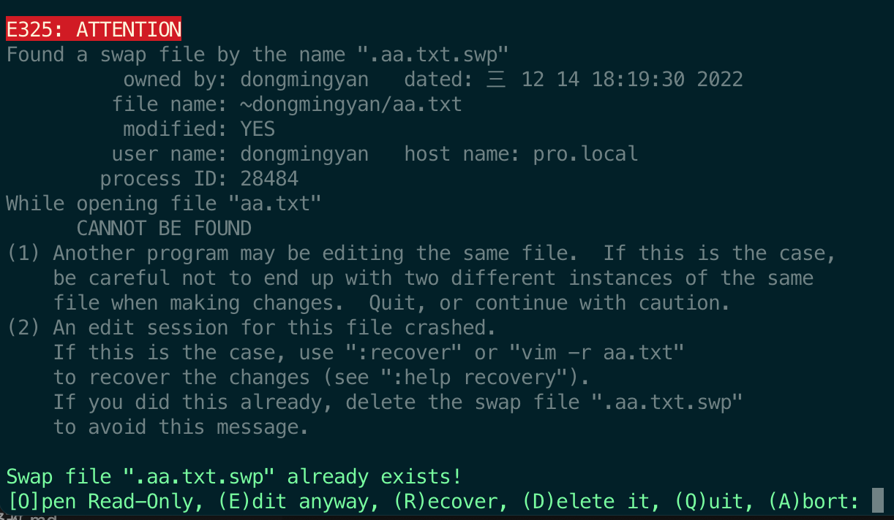

### vim swp文件
当我们用vim打开文件后，此时写入的内容，并没有直接写入到文件中，而是存在一个.swp文件中。

比如一个`aa.txt`文件在编辑时候，会将内容先写入到 `.aa.txt.swp`文件中。

正常情况下，我们编写完文件后，正常保存、退出vim后，这个.swp文件内容就写入到文件中。然后这个.swp文件也就看不到了。

但是有些异常情况，会留下.swp文件

### 异常swp文件生成
1. 在vim编辑文件过程中，还未保存就被中断（比如：和主机网路连接断了，本地终端窗口关闭等等）
2. 同有多人编辑同一个文件，此时系统会给出提示，询问处理方式。

- R 恢复此前的编写
- E 重新编辑这个文件
- D 删除文件

