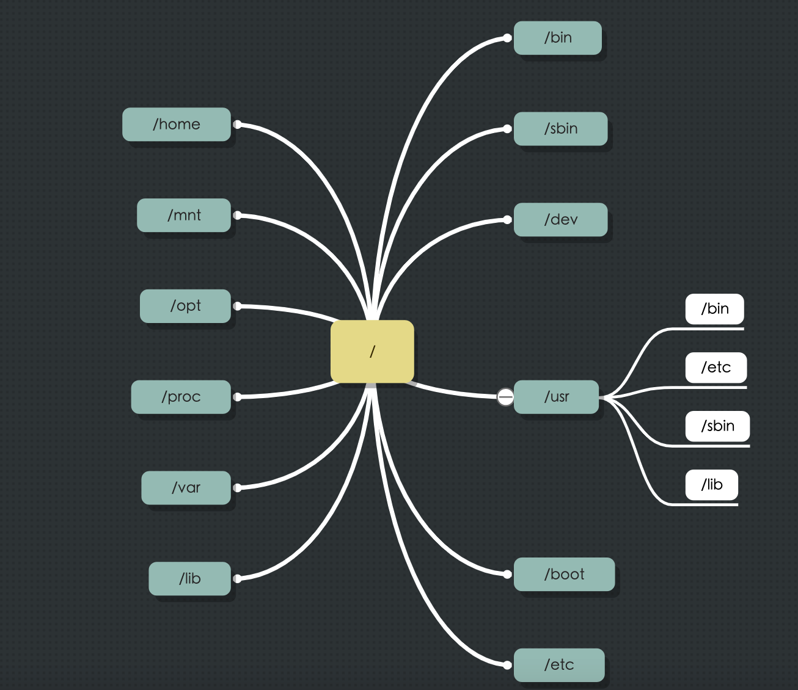

#### 文件结构

- home家目录
- mnt 挂载目录
- opt 包安装目录
- proc 内核和进程信息
- var 可变数据文件目录（比如日志）
- lib 系统共享库
- bin 基础二进制（可执行文件），比如：`ls`、`pwd`
- sbin 特殊的二进程可执行文件（相比于bin需要root权限）
- dev device简写，设备文件
- usr user的简写，用户级应用和程序文件（用户安装软件默认位置）
- boot 启动文件
- etc 配置文件

