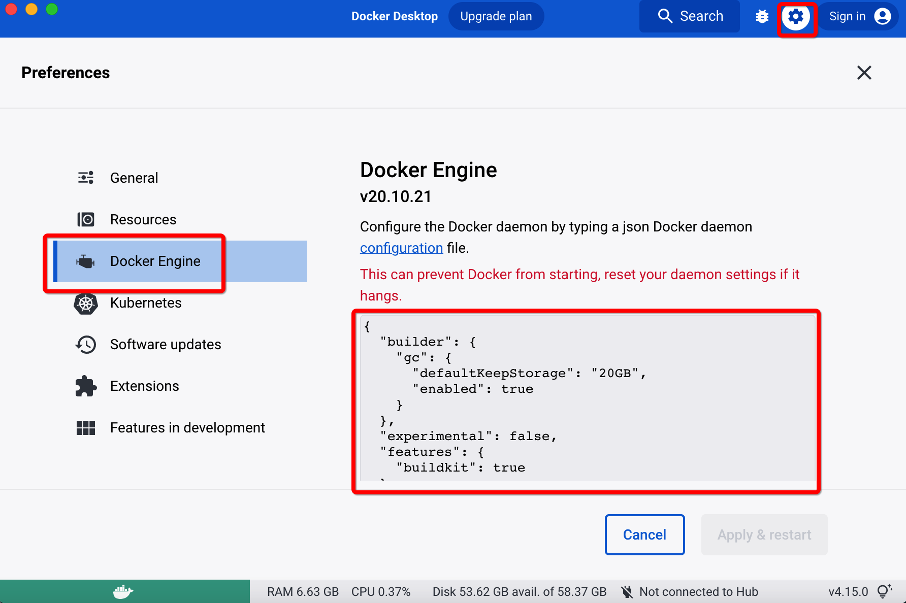

### 安装

#### mac安装
可以直接在官网上下载 Docker Desktop，然后可以桌面启动。

#### 配置镜像源
默认是国外的，特别慢，一般修改到国内的镜像源，在mac上，打开docker desktop，打开界面设置按钮，然后点击docker engine,
编辑json文件即可。

需要特别说明的是，阿里云的镜像加速地址是针对每个阿里账号设置的，位置：容器镜像服务 -> 镜像加速器里面。

```
{
  "registry-mirrors": [
    "https://hub-mirror.c.163.com",
    "https://mirror.baidubce.com"
  ]
}
```

更新配置文件后，运行命令：`docker info`查看 registry-mirrors 信息，看是否成功


