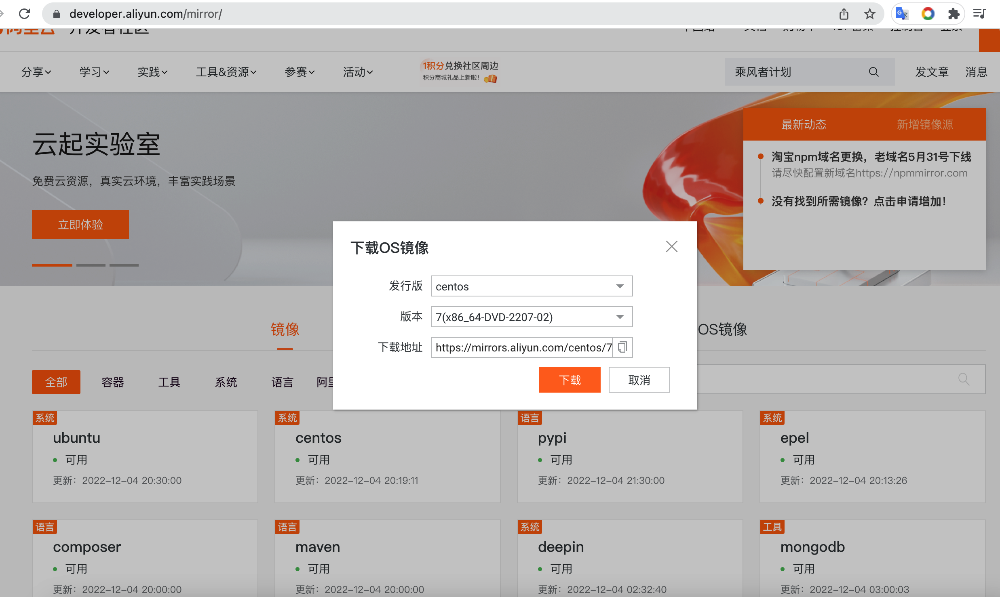
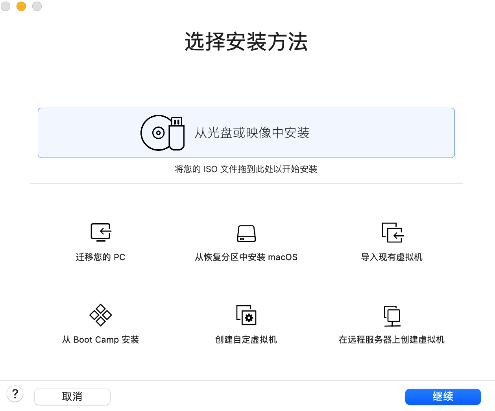

#### 虚拟机安装
mac上推荐使用vmware Fusion版本
官网：https://www.vmware.com/products/fusion.html
> PS：除了pro版本，目前对个人免费使用，还是挺好的

#### 系统镜像
我们选用国内阿里的镜像源地址：https://developer.aliyun.com/mirror/
在这个页面我们点击OS镜像就会弹出，让选择发行版、版本等信息。
下载大概4个多G
> PS: 需要注意的是，我们一般选择标准版本（不要mini功能太少，和everything)

#### 开始安装
> PS: 此时先重启下电脑，没重启发现装不了，具体不知道啥原因

1. 打开vmware,创建新的虚拟机
   
2. 点击继续
3. 选择镜像文件（下载下来的ios文件）
4. 按照提示一步步来
PS：安装时候，网络选择nat本机，不单独分配局域网ip

##### 安装完后
1. 进入界面后，右键`open terminal` 打开终端
2. 进入虚拟机界面后 `comand + tab` 切换本机和虚拟机
3. 在虚拟机中打开应用使用 `command +方向箭（上下左右）`调整应用大小

