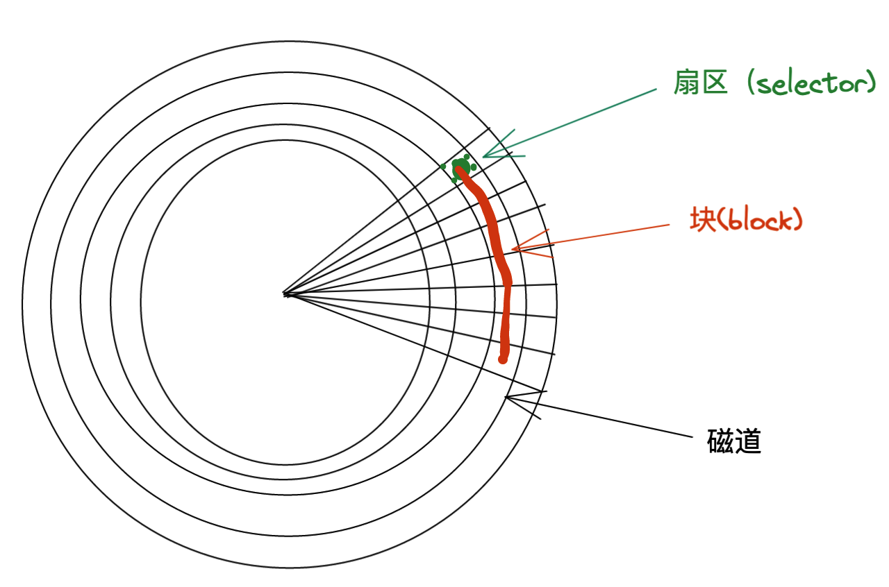

### 磁盘


#### 扇区（selector)
磁盘上的最小存储单位，大小为512bytes(字节)
PS：这是物理层面定死的，无法修改

`fdisk -l` 可以看到扇区大小
```
root@dmy-hw:~# fdisk -l
Disk /dev/loop0: 44.56 MiB, 46710784 bytes, 91232 sectors
Units: sectors of 1 * 512 = 512 bytes
Sector size (logical/physical): 512 bytes / 512 bytes
I/O size (minimum/optimal): 512 bytes / 512 bytes
```
#### 块(block)
- 同一磁道多个连续的扇区称为块。
- 大小： linux中8个扇区(8 * 512bytes)= 4kB
- 文件系统读写最小单位

如何验证？
> 我们新创建一个文件，在文件中写入一个字符，保存后，看文件大小为4K

