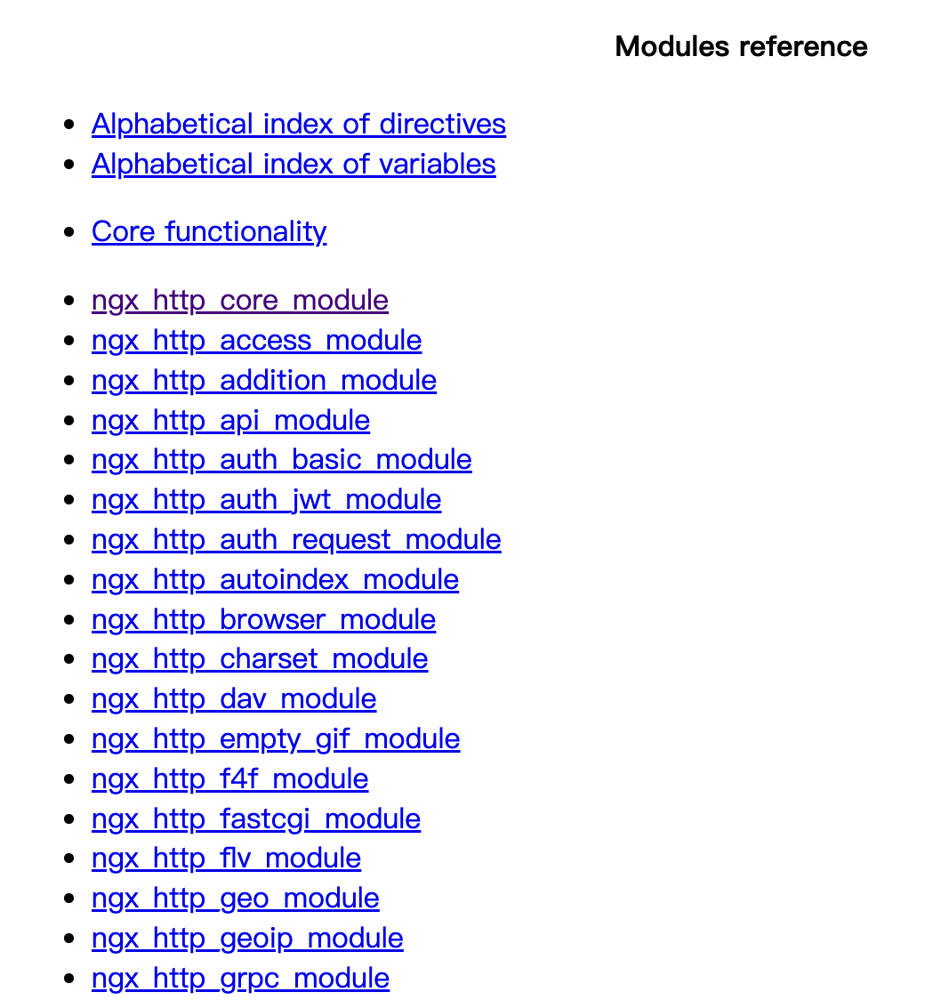

#### 基本概念

##### 1. master和work进程
在我们启动nginx后，`ps -ef | grep nginx`可以看到1个master进程和多个worker进程
```
root@hw-dmy:~# ps -ef | grep nginx
root       97899       1  0 14:44 ?        00:00:00 nginx: master process nginx
www-data   98297   97899  0 15:37 ?        00:00:00 nginx: worker process
root       98782   98704  0 16:25 pts/3    00:00:00 grep --color=auto nginx
```
- master：主要用于读配置文件和管理work进程
- worker: 主要用于真正处理请求（通常worker个数为机器核心数）

当reload配置文件时候会发生什么呢？
master进程不会变，当前worker进程会处理完当前请求后被kill掉，master生成新的worker进程（新配置）

##### 2. 模块（modules）和指令（Directives）上下文（context)
- 模块
nginx它是有一些列模块组成的，比如：http_core_module、http_log_module等等


- 指令
  简单指令：`gzip_comp_level 6;`
  块指令：`http {}`

- 上下文
  指令之间有上下文，也就是包含关系比如：server必须在http里面，那么server的上下文就是http


##### 3. 配置语法说明
1. nginx里面的配置是有层级的，有些配置只能放置在某一层也就是上下文
2. nginx配置里的注释是通过 `#`实现
3. nginx的简单指令以`;`结尾,其它是`{}`包含
4. nginx不要求写的配置要对齐啥的，主要对就行

