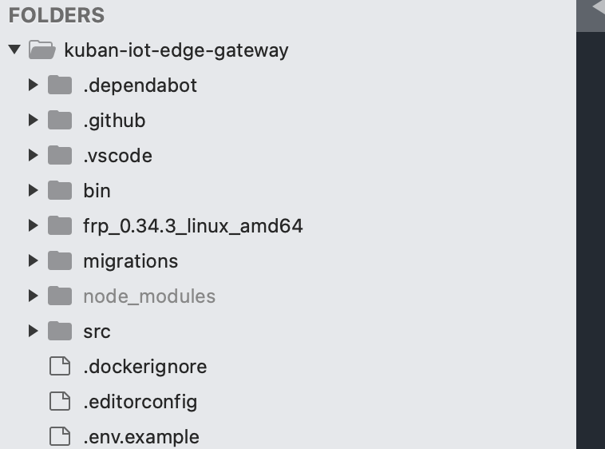

### node
临时了解一点，做下记录

#### 1. 项目结构认识

1. node_modules目录为库文件
2. migrations 表迁移文件
3. src项目的主要代码文件

#### 2. 如何启动项目？
`pm2 start start.js`
`node 一个.js文件` 直接执行，用于脚本执行，
> 也可以在终端敲 node命令，提供一个console控制台

#### 3. npm
npm命令是一个包管理命令
我们可以到 https://www.npmjs.com/ 查看搜索一些包
```
npm install pm2 -g # 安装
npm uninstall pm2  # 卸载
```
#### 4. pm2
pm2 是一个npm管理的包，主要作用在于管理应用
常用命令
```
pm2 start start.js # 启动应用 开启的是一个单例进程
pm2 list           # 列出启动列表
pm2 stop start     # 停用 后这些都行 id|name|namespace|all|json|stdin
pm2 restart all    # 重启所有
pm2 log            # 日志查看（动态的）
pm2 monit          # 监控情况
```

#### 5.require 用法
1. `require( 'dayjs' )` 直接引入一个库
2. `const db = require("./db")` 引入本地的文件

#### 5. module.exports用法
是与require 搭配起来用的
```javascript
# a.js
module.exports = {
  // 设置一些常量 
  SUCCESS: 0,
  ERROR_CANNOT_PARSE: 2,

  // 函数定义
  test_f(param1, param2) {
    console.log("param1: %s; param2: %s", param1, param2);
  }
}
```

```javascript
# b.js
const a = require('./a')

console.log(a.SUCCESS);
a.test_f(1,2)
```
命令行 `node b.js`
输出如下
```
0
param1: 1; param2: 2
```

#### 其它
我们可以在项目服务器上直接修改文件后，重启pm2后进行测试


