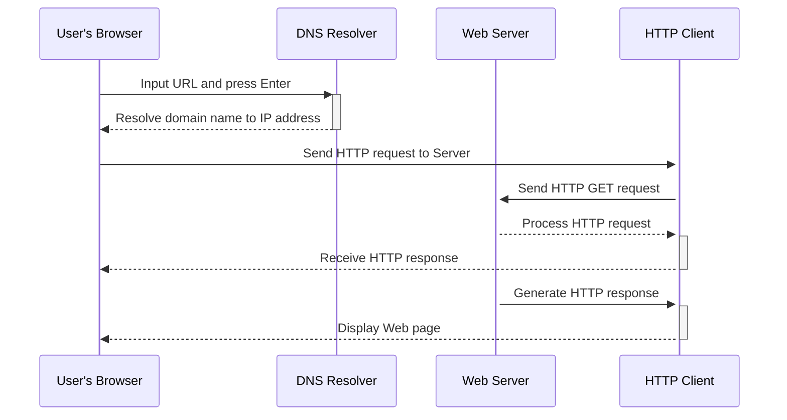

## 提示词
向gpt提问有两种方式：
1. 直接问
2. 根据它的回答继续追问

### 1. 概念解释
我是计算机小白，用通俗易懂的方式解释[线程安全]这个概念，需要包含一个例子说明

### 2. 开始发散提问
我想要快速[微服务]了解这个概念，我该如何高效提问，生成最好的10个提问

### 3. 核心点
将[go语言]最核心的20%知识点汇总，以涵盖日常使用80%的内容，并提供一个专注于掌握这些内容的学习计划

### 4. 知识树
结合分块学习法，将[go语言]拆分成小块，并搭建知识树，以帮助我快速掌握

### 5.图表形式
以Mermaid的方式，输出服务器处理请求的过程
> PS: 这里可以在vscode中安装插件——Markdown Preview 预览
> 在线展示工具：http://tooltag.cn/playground/mermaid-plugin

### 6. 知识讲解
假设你是一名经验丰富的计算机老师,我是一名计算机小白,
你需要教会我如何使用【golang中的binary包】

要求如下：
1. 用通俗易懂的方式讲解
2. 需要举多个例子说明，举例尽量经典
3. 多个例子说明不同的知识点
4. 多个例子涵盖常用的高频知识点

按照如下方式叙述：
1. 主要用于解决什么问题？它的主要作用是什么？
2. 经典使用场景1举例
3. 经典使用场景2举例
4. 金典使用场景3举例
5. 它有什么主要特点
6. 使用过程中需要注意的点有哪些？
5. 对它做一个总结

