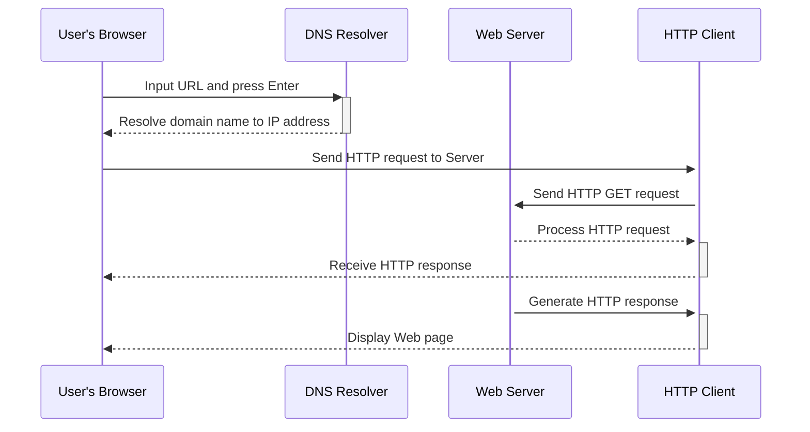

## 提示词
向gpt提问有两种方式：
1. 直接问
2. 根据它的回答继续追问

### 1. 概念解释
我是计算机小白，用通俗易懂的方式解释[线程安全]这个概念，需要包含一个例子说明

### 2. 开始发散提问
我想要快速[微服务]了解这个概念，我该如何高效提问，生成最好的10个提问

### 3. 核心点
将[go语言]最核心的20%知识点汇总，以涵盖日常使用80%的内容，并提供一个专注于掌握这些内容的学习计划

### 4. 知识树
结合分块学习法，将[go语言]拆分成小块，并搭建知识树，以帮助我快速掌握

### 5.图表形式
以Mermaid的方式，输出服务器处理请求的过程
> PS: 这里可以在vscode中安装插件——Markdown Preview 预览
> 在线展示工具：http://tooltag.cn/playground/mermaid-plugin

### 6. 知识讲解
假设你是一名经验丰富的计算机老师,我是一名计算机小白,
你需要教会我如何使用【golang中的binary包】

要求如下：
1. 用通俗易懂的方式讲解
2. 需要举多个例子说明，举例尽量经典
3. 多个例子说明不同的知识点
4. 多个例子涵盖常用的高频知识点

按照如下方式叙述：
1. 主要用于解决什么问题？它的主要作用是什么？
2. 经典使用场景1举例
3. 经典使用场景2举例
4. 金典使用场景3举例
5. 它有什么主要特点
6. 使用过程中需要注意的点有哪些？
5. 对它做一个总结

假设您是【go语言】资深老师，非常擅长向学生讲授知识,现在需要讲解【go语言GMP模型】这个知识点,要求如下：

1. 思路清晰，前后衔接连贯
2. 先交代这个知识点诞生的背景信息，在当时需要解决什么样的问题？
3. 背景信息、要解决的问题应该尽可能的完整,能以故事的方式介绍更好，激发学生热情和求知欲
4. 以简单明了的方式对这个知识点进行概述，目的是在开始学习前让学生对该知识点有一个整体的感知，建立认知框架
5. 总结列出这个知识点最核心、常用、高频的几个细分要点
6. 然后依次对细分要点进行一一讲解
7. 如果讲解的要点是一个概念，那么除了要按照专业的术语讲解外，还需要用类比的方式,以贴近生活场景的例子比喻说明，加深对概念的理解
8. 如果讲解的要点是一个具体使用方式，那么需要举例说明,如果是代码需要有详尽的注释
9. 如果整体内容太多,不要一次全部讲解，可以分多次讲解，力求做到让学生明白，知识点讲解清楚
10. 当分多次讲解时，在本次返回内容的最后需要提醒说明“本次讲解未完成，输入【继续】讲解下面的内容”
11. 如果已经对所有内容全部讲解完成,在本次返回内容最后提醒说明“当前知识点内容已全部讲解完毕,请认真学习！”,并给出和当前知识点相关的后续学习建议。

