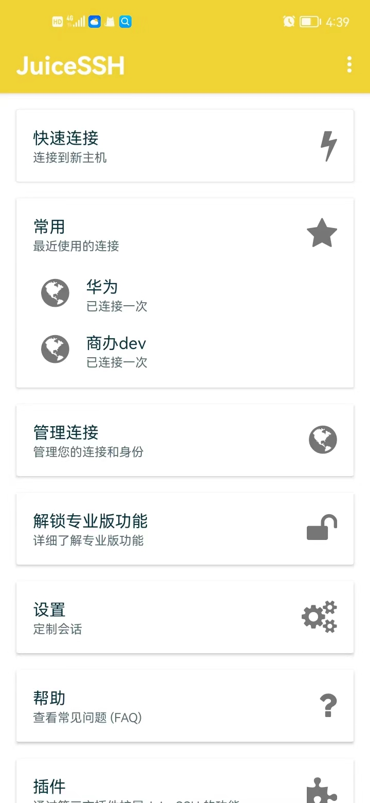

### juicessh
一款让我们在安卓手机上可以连接远程服务器的工具。
官网： https://juicessh.com/

#### 下载
默认情况下我们不能直接下载，因为需要通过google play,但是我们可以在官网上直接去找到apk包进行安装。
比如：https://juicessh-builds.s3.amazonaws.com/juicessh-v3.2.2_200.apk 通过此链接可直接下载

下载后界面默认是中文的:

#### 使用
我们可在管理链接里面去添加我们要连的服务器信息；
它分成两大块：
1. 连接
2. 认证

这样设计有个好处：
认证我们可以设置好一套秘钥信息，然后用于多个主机；

#### 关于秘钥
1. 由于它自动生成秘钥并导出的功能是要升级的，因此我们可以在mac上生成秘钥，然后将生成的私钥粘贴到app中进行设置
2. 连接的时候，需要我们输入rsa秘钥的密码(这个密码是在生成rsa的时候你输入的，要留意哦)

