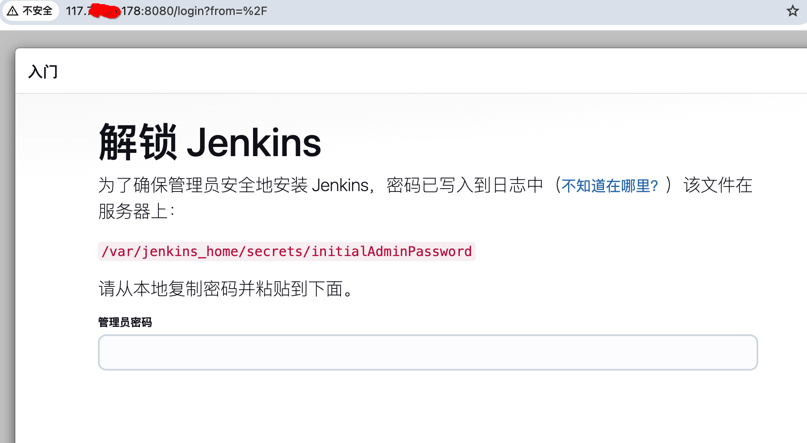
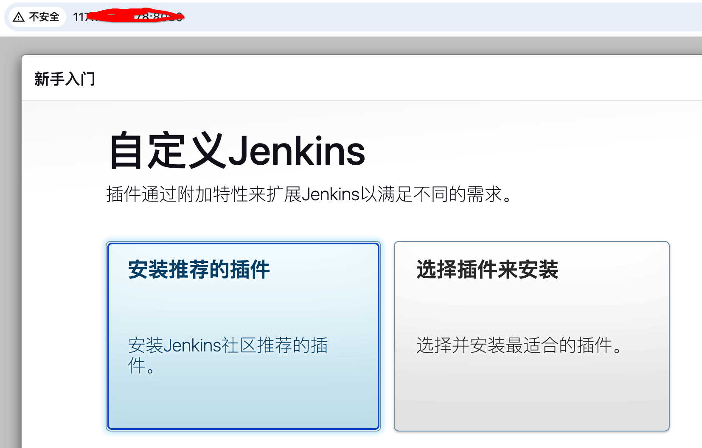
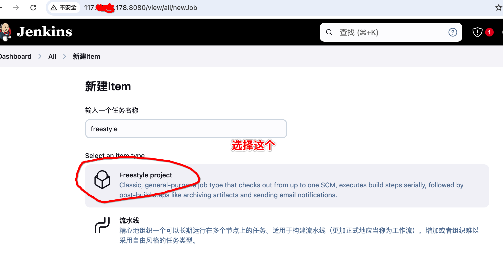
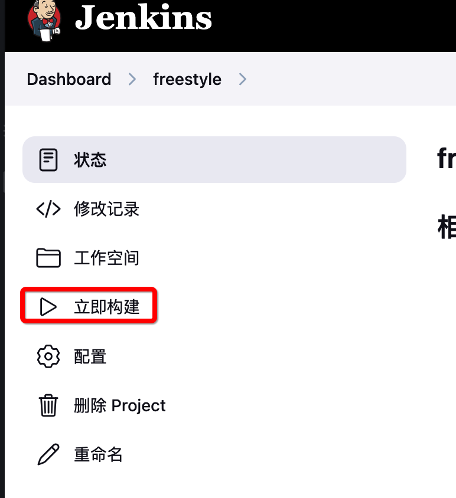
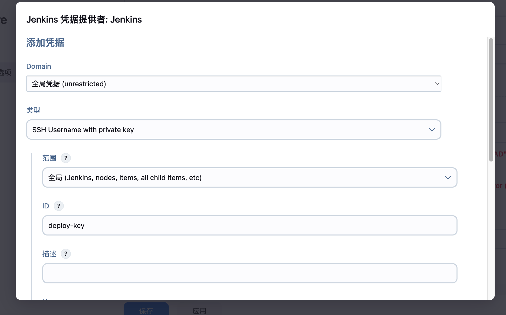
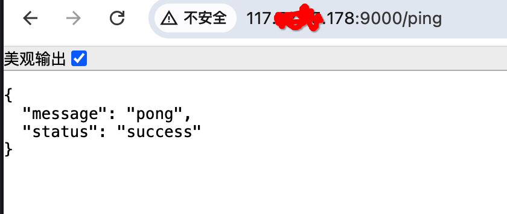

## jenkins
jenkins作为一款开源部署工具，有很多优点，比如：友好的用户界面、强大的插件生态系统、灵活的配置，可以帮助我们自动化构建、测试、部署；尤其是对于需要频繁部署的场景，让我真正做到持续集成、持续部署；今天让我们来一起学习下。

- 它能做什么？
当然是自动化部署啦！

- 怎么学呢？
最好的方式就是自己亲手操练，不入虎穴、焉得虎子。本篇我们以实战项目使用的角度，一步步搭建出一个自动化部署。

这里的步骤都是来自于真机环境，只要您跟着做，保证能成功的哦！
废话不多说，让我们直接开始。

### 一、准备工作
准备一台ubuntu或者centos服务器（用于部署jenkins、应用）

PS: 如果您真的是要自己实践下，还是建议你去买一台练习的云服务器，真实的练习下很有必要。
这里我已经买好了一台云服务器，它是centos的（总体和ubuntu差别不大的），我们就在这台服务器上做演示。

服务器好了后，我们第一件要做的事就是，给服务器安装docker

1. 安装docker服务
```shell
# 检查更新
sudo yum check-update

# 安装管理工具
sudo yum install -y yum-utils device-mapper-persistent-data lvm2

# 添加镜像源
sudo yum-config-manager --add-repo http://mirrors.aliyun.com/docker-ce/linux/centos/docker-ce.repo

# 安装docker
sudo yum install docker-ce docker-ce-cli containerd.io

# 启动docker服务
sudo systemctl start docker
sudo systemctl enable docker 
```

总体没有什么特别的，需要注意上面配置了安装docker安装镜像地址`http://mirrors.aliyun.com/docker-ce/linux/centos/docker-ce.repo`。

2. 配置docker容器镜像
这一步是必须的，国内环境直接拉取不了国外镜像。
`sudo /etc/docker/daemon.json` 编辑文件
```json
{
    "registry-mirrors": [
        "https://docker.unsee.tech",
    ],
    "insecure-registries": [
      "docker.unsee.tech" // PS: 这里镜像注册地址 也配置下 不然还是会去docker hub拉镜像的哦。
    ] 
}
```

重启docker 服务
```shell
sudo systemctl daemon-reload
sudo service docker restart 
```

3. 验证docker是否可用
```shell
docker run  hello-world
Unable to find image 'hello-world:latest' locally
latest: Pulling from library/hello-world
c1ec31eb5944: Pull complete 
Digest: sha256:5b3cc85e16e3058003c13b7821318369dad01dac3dbb877aac3c28182255c724
Status: Downloaded newer image for hello-world:latest

Hello from Docker!
This message shows that your installation appears to be working correctly.

To generate this message, Docker took the following steps:
 1. The Docker client contacted the Docker daemon.
 2. The Docker daemon pulled the "hello-world" image from the Docker Hub.
    (amd64)
 3. The Docker daemon created a new container from that image which runs the
    executable that produces the output you are currently reading.
 4. The Docker daemon streamed that output to the Docker client, which sent it
    to your terminal.

To try something more ambitious, you can run an Ubuntu container with:
 $ docker run -it ubuntu bash

Share images, automate workflows, and more with a free Docker ID:
 https://hub.docker.com/

For more examples and ideas, visit:
 https://docs.docker.com/get-started/
```
输出上面内容，表明ok的。

### 二、安装jenkins
我们以docker的方式启动jenkins服务

#### 1. 目录准备
服务器上我们先创建一个目录，用于挂载jenkins容器内目录,在家目录（`~`）下执行
```shell
mkdir -p dmy_project/jenkins
sudo chown -R 1000:1000 /root/dmy_project/jenkins  # 添加权限
```

#### 2. 拉取启动jenkins
```shell
docker pull jenkins/jenkins:lts # 拉取官方版本

# 这里把宿主机的容器操作 给予docker容器内部处理
docker run -p 8080:8080  \
  -v /root/dmy_project/jenkins:/var/jenkins_home \
  --name jenkins \
  -d jenkins/jenkins:lts
```

检查下服务是否启动好了
```shell
docker ps -a
CONTAINER ID   IMAGE                 COMMAND                  CREATED          STATUS                      PORTS                                                  NAMES
ab5b52a2e7a7   jenkins/jenkins:lts   "/usr/bin/tini -- /u…"   2 minutes ago    Up 35 seconds               0.0.0.0:8080->8080/tcp, :::8080->8080/tcp, 50000/tcp   jenkins
```

这里要注意端口映射地址在8080，记得在服务器上开放此端口号。

### 三、初始化配置jenkins界面
此时，在浏览器访问`http://{服务器IP地址}:8080`,可以看到如下界面：


由于我们把`/var/jenkins_home`挂载在`/root/dmy_project/jenkins`目录下的，因此我们到`/root/dmy_project/jenkins`下执行:
```shell
# 查看管理员密码
cat secrets/initialAdminPassword
2d873982638a4acebc5456ea6c7xxxxy
```
然后,将密码填入web页面**管理员密码**位置，然后回车，进入下面界面

直接安装推荐的插件就好，整个安装过程大概几分钟吧。


安装完后，创建自己的一个账号、密码；后续就可以用这个密码直接登录了。


### 四、自由风格项目
现在我们可以来玩玩了，先来创建一个自由风格的条目，所谓自由风格，其实就是自己定义启动shell命令。


我们先创建一个简单的item来试试，名字就叫`freestyle`吧


向下找到`Build Steps`,选择`执行shell`,shell我们写的简单一点，就下面的
```shell
pwd
touch test.txt
```
然后保存。

回到主界面，点击立即构建

运行完后，会在此节目的左下角看到**#1**，代表这个是这个item构建的第一次结果，点开它，然后点击控制台输出,内容如下
```
Started by user dmy
Running as SYSTEM
Building in workspace /var/jenkins_home/workspace/freestyle
[freestyle] $ /bin/sh -xe /tmp/jenkins1046110368421100086.sh
+ pwd
/var/jenkins_home/workspace/freestyle
+ touch test.txt
Finished: SUCCESS
```
我们可以看到`pwd`命令,执行后的输出是`/var/jenkins_home/workspace/freestyle`;

这个目录是我们启动docker时挂载的，我们通过ssh连上服务器去看看它，
```shell
root@lavm-128n79ue68 ~/dmy_project/jenkins/workspace/freestyle
ls
test.txt
```
同时能发现它还在这里创建了`test.txt`,这里说明什么，这里
1. 说明shell命令它在jenkins容器中去成功执行了
2. 它还会为每个item创建一个目录，这里是`freestyle`

好啦！，其它您可以自行探索啦。


### 五. go项目准备
#### 1. 初始化项目
创建目录：`mkdir jenkins_project`
添加文件 `touch main.go` 
```go
package main

import "github.com/gin-gonic/gin"

func main() {
	r := gin.Default()
	r.GET("/ping", func(c *gin.Context) {
		c.JSON(200, gin.H{
			"status":  "success",
			"message": "pong",
		})
	})
	r.Run(":9000")
}
```
执行`go mod tidy` 初始化。

#### 2. 添加Dockerfile
`touch Dockerfile`
```shell
# 构建阶段
FROM golang:1.22.3-alpine AS builder
WORKDIR /app
# 设置代理 否则很慢
ENV GOPROXY=https://goproxy.cn,direct
COPY . .
RUN go mod download
RUN CGO_ENABLED=0 GOOS=linux go build -o main .

# 运行阶段
FROM alpine:latest
WORKDIR /app
COPY --from=builder /app/main .
EXPOSE 9000
CMD ["./main"]
```

#### 3. 添加`Jenkinsfile`文件

```shell
pipeline {
    agent any
    
    parameters {
        choice(
            name: 'DEPLOY_ENV',
            choices: ['dev', 'test', 'prod'],
            description: '选择部署环境'
        )
    }
    
    environment {
        DOCKER_IMAGE = 'dmy-go-app'
        DOCKER_TAG = 'latest'
        // 直接定义服务器列表
        DEV_SERVERS = '117.yy.xx.178'
        TEST_SERVERS = '192.168.2.101,192.168.2.102,192.168.2.103'
        PROD_SERVERS = '10.0.1.101,10.0.1.102,10.0.1.103,10.0.1.104'
        // SSH 用户名改为 root 默认情况是 jenkins
        DEPLOY_USER = 'root'
        // 镜像文件名
        IMAGE_TAR = 'dmy-go-app.tar'
    }
    
    stages {
        stage('Checkout') {
            steps {
                checkout scm
            }
        }
        
        stage('Build Image') {
            steps {
                script {
                    // 构建 Docker 镜像
                    sh "docker build -t ${DOCKER_IMAGE}:${DOCKER_TAG} ."
                    // 保存镜像为文件
                    sh "docker save ${DOCKER_IMAGE}:${DOCKER_TAG} -o ${IMAGE_TAR}"
                }
            }
        }
        
        stage('Deploy') {
            steps {
                script {
                    // 根据环境选择服务器列表
                    def serverList = []
                    switch(params.DEPLOY_ENV) {
                        case 'dev':
                            serverList = env.DEV_SERVERS.split(',')
                            break
                        case 'test':
                            serverList = env.TEST_SERVERS.split(',')
                            break
                        case 'prod':
                            serverList = env.PROD_SERVERS.split(',')
                            break
                    }
                    
                    // 部署命令
                    def deployCmd = """
                        docker load -i ${IMAGE_TAR} && \
                        docker stop ${DOCKER_IMAGE} || true && \
                        docker rm -f ${DOCKER_IMAGE} || true && \
                        docker run -d \
                            --name ${DOCKER_IMAGE} \
                            --restart unless-stopped \
                            -p 9000:9000 \
                            ${DOCKER_IMAGE}:${DOCKER_TAG} && \
                        rm -f ${IMAGE_TAR}
                    """
                    
                    // 这里的deploy-key代表的是 jenkins全局配置时中的Id
                    sshagent(['deploy-key']) {
                        serverList.each { server ->
                            echo "Deploying to server: ${server}"
                            // 传输 Docker 镜像文件
                            sh "scp -o StrictHostKeyChecking=no ${IMAGE_TAR} ${env.DEPLOY_USER}@${server}:~/"
                            // 加载镜像并运行容器
                            sh "ssh -o StrictHostKeyChecking=no ${env.DEPLOY_USER}@${server} '${deployCmd}'"
                        }
                    }
                }
            }
        }
    }
    
    post {
        always {
            // 清理本地镜像文件
            sh "rm -f ${IMAGE_TAR}"
        }
        failure {
            echo 'Pipeline failed! Please check the logs.'
        }
        success {
            echo 'Pipeline succeeded! Application is deployed.'
        }
    }
}
```

上面的jenkinsfile文件，是为我们jenkins web节目配置使用的；

另外上面的文件部署思路是，**先用docker 构建出镜像，然后传递到各个部署的服务器**，启动服务的方式。

我们把这个项目的代码上传到github上，准备待用。

### 六、jenkins容器中安装docker
#### 1. 共用宿主机docker dameon
由于上面Jenkinsfile中，我们在jenkins容器内构建出镜像，因此必须要在容器内安装docker才行。

但是，我们不在jenkins容器中重新启动一个docker daemon，直接使用宿主机的就行，因此我们重新运行jenkins服务，
把宿主机的dameon挂载加上
```shell
docker stop jenkins
docker rm jenkins

# 挂载后运行
docker run -p 8080:8080  \
  -v /root/dmy_project/jenkins:/var/jenkins_home \
  -v /var/run/docker.sock:/var/run/docker.sock \
  --name jenkins \
  -d jenkins/jenkins:lts
```

#### 2. jenkins容器内安装docker
由于Jenkins容器内部，安装起来不是很方便，这里找了一个脚本来安装脚本如下：
```shell
# 宿主机上执行
curl -fsSL https://get.docker.com -o get-docker.sh  

# 编辑get-docker.sh文件将其中的mirror改成Aliyun如下
# mirror='Aliyun'

# 我们把它放在宿主机的`get-docker.sh`文件，我们把它拷贝到容器中，然后执行
docker cp get-docker.sh jenkins:/root
# Successfully copied 24.1kB to jenkins:/root

# 进入容器 安装
docker exec -u root -it jenkins bash
root@ab5b52a2e7a7:/# ls
bin  boot  dev	etc  home  lib	lib64  media  mnt  opt	proc  root  run  sbin  srv  sys  tmp  usr  var
root@ab5b52a2e7a7:/# cd root
root@ab5b52a2e7a7:~# sh get-docker.sh 
# Executing docker install script, commit: 711a0d41213afabc30b963f82c56e1442a3efe1c
+ sh -c apt-get -qq update >/dev/null
```
这里要花很长的时间，耐心等待。

### 六、流水线项目
上面我们简单的尝试了自由风格项目，但是在实际项目中，我们用的更多的是用流水线方式，这里我们以`go`项目为例演示流水线的使用方式。
#### 1. ssh密钥生成
在云服务器上执行：
```
# 生成 SSH 密钥对
ssh-keygen -t rsa -b 4096 -f ~/.ssh/jenkins_deploy

# 将公钥添加到授权密钥中(要连的服务器上)
cat ~/.ssh/jenkins_deploy.pub >> ~/.ssh/authorized_keys
```

#### 2. github仓库配置ssh key
把我们上面生成的ssh 公钥(`jenkins_deploy.pub`)同时也配置到github中，具体步骤省略了，请自行操作。


#### 3. 新建流水线项目
新建项目，名叫`pipelin`,选择流水线，确定
找到流水线，
1. 在定义这里选择`Pipeline script from SCM`
2. SCM 选择`git`
   Repository URL,填入github仓库地址：`https://github.com/yourname/jenkins_project` yourname替换成你自己的
3. 添加全局凭证
  
- 类型选择`SSH Username with private key`
- ID 填`deploy-key`，和前面jenkinsfile中保持一致
- Username 随便写一个
- Private Key 中填入上面生成ssh密钥的私钥
4. 指定分支，为我们项目部署使用的分支，这里我的是`main`
5. 脚本路径，我们的文件名是`Jenkinsfile`就填这个
保存。


#### 4. 添加ssh agent 插件
由于我们的Jenkinsfilez中使用了 sshagent，我们去安装下插件。在Dashboard > Manage Jenkins > 插件管理,选择available plugins然后搜索`ssh agent`,勾选然后，点击安装。


#### 5.立即构建
总算到这一步了，我们现在开始立即构建，构建完后，将会看到如下内容：
```shell
+ ssh -o StrictHostKeyChecking=no root@117.xx.yy.178 
                        docker load -i dmy-go-app.tar &&                         docker stop dmy-go-app || true &&                         docker rm -f dmy-go-app || true &&                         docker run -d                             --name dmy-go-app                             --restart unless-stopped                             -p 9000:9000                             dmy-go-app:latest &&                         rm -f dmy-go-app.tar
                    
Loaded image: dmy-go-app:latest
Error response from daemon: No such container: dmy-go-app
Error response from daemon: No such container: dmy-go-app
a2a98a6605287e75a7b1feacb9c90e2a5f59f255be47880272c43aeee2b2d951
[Pipeline] }
$ ssh-agent -k
unset SSH_AUTH_SOCK;
unset SSH_AGENT_PID;
echo Agent pid 1734 killed;
[ssh-agent] Stopped.
[Pipeline] // sshagent
[Pipeline] }
[Pipeline] // script
[Pipeline] }
[Pipeline] // stage
[Pipeline] stage
[Pipeline] { (Declarative: Post Actions)
[Pipeline] sh
+ rm -f dmy-go-app.tar
[Pipeline] echo
Pipeline succeeded! Application is deployed.
[Pipeline] }
[Pipeline] // stage
[Pipeline] }
[Pipeline] // withEnv
[Pipeline] }
[Pipeline] // withEnv
[Pipeline] }
[Pipeline] // node
[Pipeline] End of Pipeline
Finished: SUCCESS
```
说明整体运行成功，最后我们的go程序监听的是9000端口，记得在云服务器上打开它。就可以发起请求了。

我们在浏览器试下


已经成功啦。

### 七、写在最后
对于jenkins部署是一个渐进的过程，不要想着一次把jenkinsfile写好，这是一个逐渐优化的过程，我们慢慢来、逐渐练习。先跑通一个简单的项目部署，然后逐步扩展就能熟练应对复杂的项目了。

