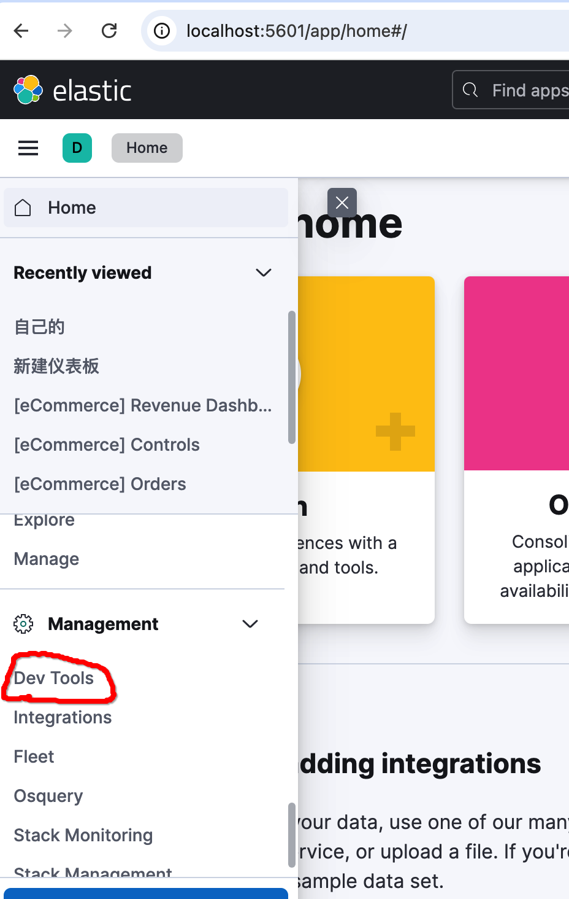
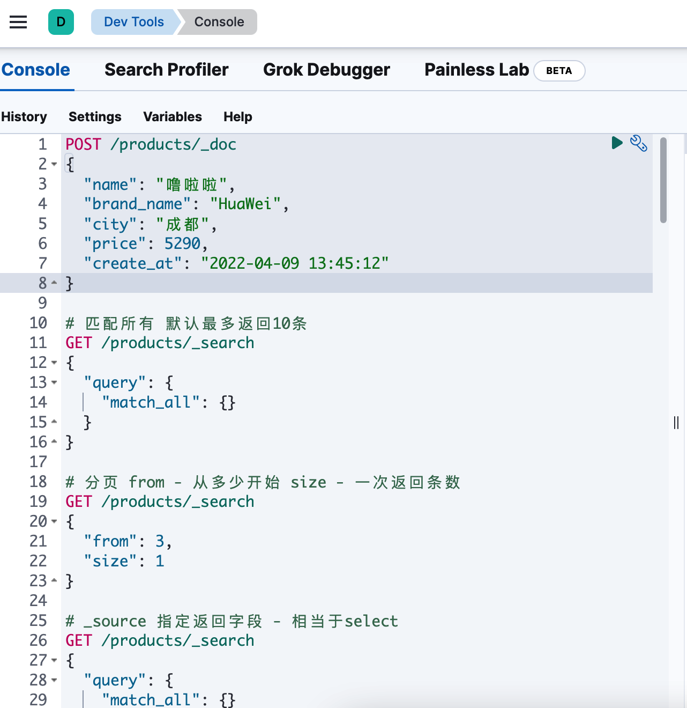

## 快速开始elasticsearch

### 一、环境搭建
我们通过docker开始启动elasticsearch、和kibana
`docker-compose.yml`文件如下：
```yaml
services:
  elasticsearch:
    image: elasticsearch:8.10.1
    environment:
      - discovery.type=single-node # 单节点开发环境
      - xpack.security.enabled=true # 启用安全认证
      - ELASTIC_PASSWORD=your_elastic_password # 设置一个强密码
      - "ES_JAVA_OPTS=-Xms512m -Xmx512m" # 根据需要调整内存
    ports:
      - "9200:9200"
      - "9300:9300"
    networks:
      - elastic
    healthcheck: # 改进的健康检查
      test: ["CMD-SHELL", "curl -s http://localhost:9200/_cluster/health >/dev/null || exit 1"]
      interval: 10s
      timeout: 5s
      retries: 5
    volumes:
      - esdata:/usr/share/elasticsearch/data # 持久化数据

  kibana:
    image: kibana:8.10.1
    environment:
      ELASTICSEARCH_HOSTS: http://elasticsearch:9200
      ELASTICSEARCH_USERNAME: kibana_system # 这个用户是es默认创建的
      ELASTICSEARCH_PASSWORD: abcdefg # 设置成你自己的密码
      ELASTICSEARCH_SSL_VERIFICATIONMODE: none
      XPACK_SECURITY_ENABLED: "true"
      XPACK_ENCRYPTEDSAVEDOBJECTS_ENCRYPTIONKEY: "something_at_least_32_characters"
    ports:
      - "5601:5601"
    depends_on:
      - elasticsearch
    networks:
      - elastic
    healthcheck:
      test: ["CMD-SHELL", "curl -s http://localhost:5601 >/dev/null || exit 1"]
      interval: 30s
      timeout: 10s
      retries: 3

networks:
  elastic:

volumes:
  esdata:
```

由于8.10.1版本kibana不能通过默认的elastic（超级用户）账户登录，这里我们通过另外一个非超级用户的账号kibana_system做登录。
这个用户es默认已经创建好了，我们只需要初始化它的密码就行。

按如下步骤操作
#### 1. 启动 Elasticsearch
首先只启动 Elasticsearch 服务：
```bash
docker-compose up elasticsearch -d
```

等待 Elasticsearch 完全启动（大约需要 1-2 分钟）。

#### 2. 重置密码
执行命令`docker-compose exec elasticsearch bin/elasticsearch-reset-password -u kibana_system -i`进入交互界面

大概这样
```bash
dongmingyan@pro  ⮀ docker-compose exec elasticsearch bin/elasticsearch-reset-password -u kibana_system -i
This tool will reset the password of the [kibana_system] user.
You will be prompted to enter the password.
Please confirm that you would like to continue [y/N]y


Enter password for [kibana_system]: 
Re-enter password for [kibana_system]: 
Password for the [kibana_system] user successfully reset.
```
这里需要注意的一点是密码要设置成字符串，不要设置成纯数字——它不支持。
这里我把密码设置成abcdefg了，如果你是其它密码记得去`docker-compose.yml`改`ELASTICSEARCH_PASSWORD`密码哦

#### 3. 启动完整服务
启动所有服务：
```bash
docker-compose up -d
```
这里启动过程需要点时间，耐心等待下。

#### 5. 访问服务
可以开始访问啦！
- Elasticsearch: http://localhost:9200
- Kibana: http://localhost:5601

我们登录kibana，使用默认用户名 `elastic`，密码用docker-compose.yml中环境变量写的`your_elastic_password`直接登录.

>补充知识：
**kibana**是elasticsearch可视化数据分析工具，对于我们学习练习使用非常方便。

### 二、数据准备
在开始前，我们先准备一些测试数据，为方便理解，我们以电商系统常用数据做分析。

#### 1. 初试
前面我们已经成功登录到kibana了，我们登录后，先找到左侧的三个横杠点击，`management > Dev Tools`


然后打开它。


上面我们可以看到在console中已经列出了一些请求数据，这是kibana为了我们方便学习，自动展示的。

让我为你解释下，elasticsearch对外提供的是http服务，因此这里看到的都是各种请求（`POST`/`GET`）， 比如：

- **新增**
```shell
POST /products/_doc
{
  "name": "噜啦啦",
  "brand_name": "HuaWei",
  "city": "成都",
  "price": 5290,
  "create_at": "2022-04-09 13:45:12"
}
```
  
它相当于
```shell
curl -X POST http://localhost:9200/products/_doc -u "elastic:your_elastic_password" -H 'Content-Type: application/json' -d'
{
  "name": "噜啦啦",
  "brand_name": "HuaWei",
  "city": "成都",
  "price": 5290,
  "create_at": "2022-04-09 13:45:12"
}'
```
我们点击console中请求右侧的`▶️`即可发出请求。发出去后就会向es products索引中写入一条文档。

- **概念说明**
1. products es中叫**索引**index
2. 请求体{"name": "xx", "brand_name": "yy", ...} es中称这为**文档`doc`**,相当于数据库中一行数据记录
3. 请求体中具体内容比如"name"就是**字段/属性**啦，需要注意的是es中字段是支持嵌套

让我们继续，继续点击第二个请求查询下products索引有哪些文档。
- **搜索**
```
# 匹配所有 默认最多返回10条
GET /products/_search
{
  "query": {
    "match_all": {}
  }
}
```
响应内容如下：
```
{
  "took": 0,
  "timed_out": false,
  "_shards": {
    "total": 1,
    "successful": 1,
    "skipped": 0,
    "failed": 0
  },
  "hits": {
    "total": {
      "value": 1,
      "relation": "eq"
    },
    "max_score": 1,
    "hits": [
      {
        "_index": "products",
        "_id": "SZcbJ5QBrDMs_aLvWrgT",
        "_score": 1,
        "_source": {
          "name": "噜啦啦",
          "brand_name": "HuaWei",
          "city": "成都",
          "price": 5290,
          "create_at": "2022-04-09 13:45:12"
        }
      }
    ]
  }
}
```
大概您也能看明白，一般我们就关注`hits`的`total`和`_source`数据就行啦。

- **更新**
我们来更新文档试试呢？在上面我们看到其中一个文档的id`SZcbJ5QBrDMs_aLvWrgT`,我们就更新它啦。

在console中写下如下的请求
```shell
# products 索引名
# SZcbJ5QBrDMs_aLvWrgT 文档id
POST /products/_update/SZcbJ5QBrDMs_aLvWrgT
{
  "doc": {
    "name": "新产品",
    "price": 5800
  }
}
```
发送后我们重新，查询products有哪些文档，发现对应id的name已经变了。

- **删除**
那删除文档怎么写呢？
```shell
DELETE /products/_doc/SZcbJ5QBrDMs_aLvWrgT
```
好啦！其它您可以自行探索啦。

#### 2. 准备数据
在开始准备测试数据之前，先补充下前面我们漏掉的知识点，前面我们执行
```shell
POST /products/_doc
{
  "name": "噜啦啦",
  "brand_name": "HuaWei",
  "city": "成都",
  "price": 5290,
  "create_at": "2022-04-09 13:45:12"
}
```
直接就将数据写入到了products 索引中，我们也说了它类似于数据库中的表；但是在关系型数据库中，必须先建表才能写数据的，这里为啥就直接能写呢？

**es中它会自动生成映射，也就是索引不存在时，自动创建索引**
您可以把products换成其它任意索引名试试，也是可以成功的。

- **查看索引mapping**
那如何查看一个索引有哪些字段/属性呢？es中称为**mapping关系**
```shell
# console中执行查看
GET /products/_mapping

# {
#   "products": {
#     "mappings": {
#       "properties": {
#         "brand_name": {
#           "type": "text",
#           "fields": {
#             "keyword": {
#               "type": "keyword",
#               "ignore_above": 256
#             }
#           }
#         },
#         .....
#       }
#     }
#   }
# }
```

- **创建索引mapping**
前面我们的索引mapping，是通过自动生成的，这里我们手动生成

我们以电商系统经常用到的订单举例，假设索引名为orders
```json
// console执行 创建名为orders的索引，mapping结构体如下
PUT /orders 
{
  "mappings": {
    "properties": {
      "order_id": {
        "type": "keyword"
      },
      "customer_id": {
        "type": "keyword"
      },
      "customer_name": {
        "type": "text"
      },
      "order_date": {
        "type": "date"
      },
      "total_amount": {
        "type": "float"
      },
      "payment_method": {
        "type": "keyword"
      },
      "shipping_address": {
        "type": "text"
      },
      "order_status": {
        "type": "keyword"
      },
      "items": {
        "type": "nested",
        "properties": {
          "product_id": {
            "type": "keyword"
          },
          "product_name": {
            "type": "text"
          },
          "category": {
            "type": "keyword"
          },
          "quantity": {
            "type": "integer"
          },
          "price": {
            "type": "float"
          }
        }
      }
    }
  }
}
```

执行完后，可以通过`GET /orders/_mapping`查看会发现索引、mapping都已成功建立。

- **批量构建测试数据**
我们构建测试数据，最好的方式是通过脚本快速生成测试数据，但从方便性上考虑，我们直接生成了测试数据`bulk_data.json`

直接发请求去创建数据
PS：注意curl目录应该和bulk_data.json目录在同一目录哦
```shell
curl -X POST "http://localhost:9200/orders/_bulk" -u "elastic:your_elastic_password" -H "Content-Type: application/json" --data-binary "@bulk_data.json"
```

我bulk_data.json内是200条数据，让我们验证下
```shell
# kibana console 中执行
GET /orders/_count

# {
#   "count": 200,
#   "_shards": {
#     "total": 1,
#     "successful": 1,
#     "skipped": 0,
#     "failed": 0
#   }
# }
```
ok, 我们的测试数据已经构建完成啦。


### 三、练习
#### 1. 基本搜索
- **1. 单一条件查询**
假设我们想搜索顾客姓名为张三的订单数据
```shell
curl -X GET "http://localhost:9200/orders/_search" -u "elastic:your_elastic_password" -H "Content-Type: application/json" -d'
{
  "query": {
    "match": { "customer_name": "张三" }
  }
}'
```
- **2. 多条件查询**
添加支付方式为微信的订单
PS: 多条件时，将匹配条件放于must中
```shell
curl -X GET "http://localhost:9200/orders/_search" -u "elastic:your_elastic_password" -H "Content-Type: application/json" -d'
{
  "query": {
    "bool": {
      "must": [
        { "match": { "customer_name": "张三" } },
        { "term": { "payment_method": "微信" } }
      ]
    }
  }
}'
```
这里会正常匹配出张三、微信支付的数据，需要注意的是：
- must用于多个条件同时满足。
- **`match` 用于text类型数据的全文搜索，会有分词的情况**
- **`term` 适合keyword类型数据，它是不分词的——作为整体去处理**

假设我们像在前面进一步搜索，订单金额大于200的订单呢？
```shell
curl -X GET "http://localhost:9200/orders/_search" -u "elastic:your_elastic_password" -H "Content-Type: application/json" -d'
{
  "query": {
    "bool": {
      "must": [
        { "match": { "customer_name": "张三" } },
        { "term": { "payment_method": "微信" } },
        {"range": { "total_amount": {"gt": 200 }}}
      ]
    }
  }
}'
```

- **3. 嵌套搜索**
来继续.我们搜索商品类型是服饰的商品呢？
我们的商品信息是放在items内部这里嵌套了
1. 使用`nested` 包裹一层，**path: 指明嵌套路径**
2. 使用`外层字段.内层字段`方式嵌套搜索

```shell
curl -X GET "http://localhost:9200/orders/_search" -u "elastic:your_elastic_password" -H "Content-Type: application/json" -d'
{
  "query": {
    "bool": {
      "must": [
        { "match": { "customer_name": "张三" } },
        { "term": { "payment_method": "微信" } },
        {"range": { "total_amount": {"gt": 200 }}},
        {
          "nested": {
            "path": "items",
            "query": {
              "term": {
                "items.category": "服饰"
              }
            }
          }
        }
      ]
    }
  }
}'
```

好啦，相信进过前面的练习，您也对基本查询有了足够的了解。

#### 2. 聚合统计
搜索只是es最基础的功能，es最强大的地方是数据分析，要数据分析，一定要会使用聚合统计。我们由简单到复杂一步步开始。

- **1.term分组聚合**
比如我们按照支付方式，统计每种支付方式的订单数据。这是最简单的统计，如果您在关系型数据库中，也就是 `Group` 配合`Count`完成，那在es中要怎么写呢？

```shell
curl -X GET "http://localhost:9200/orders/_search" -u "elastic:your_elastic_password" -H "Content-Type: application/json" -d' {
  "aggs": {
    "payment_methods": {
      "terms": {
        "field": "payment_method"
      }
    }
  },
  "size": 0
}'

# {
#     "took": 13,
#     "timed_out": false,
#     "_shards": {
#         "total": 1,
#         "successful": 1,
#         "skipped": 0,
#         "failed": 0
#     },
#     "hits": {
#         "total": {
#             "value": 200,
#             "relation": "eq"
#         },
#         "max_score": null,
#         "hits": [ ]
#     },
#     "aggregations": {
#         "payment_methods": {
#             "doc_count_error_upper_bound": 0,
#             "sum_other_doc_count": 0,
#             "buckets": [
#                 {
#                     "key": "银行卡",
#                     "doc_count": 70
#                 },
#                 {
#                     "key": "支付宝",
#                     "doc_count": 66
#                 },
#                 {
#                     "key": "微信",
#                     "doc_count": 64
#                 }
#             ]
#         }
#     }
# }
```

解释下聚会的基本格式是：
```json
{
  "size": 0, 
  "aggs": {
    "your_aggregation_name": {
      "terms": {
        "field": "your_field_name",
        "size": 10 
      }
    }
  }
}

// 两个size都是可省略的
// 1. 外层size: 0 代表不返回具体文档
// 2. 内层size: 10 代表只返回聚合后桶的个数（比如前面的例子如果2的话，只返回2个桶——银行卡、支付宝）
```

- **2.Range范围聚合**
如果我们想知道总价在各个价格段的订单数量，我们可以使用range聚合实现。
```shell
curl -X GET "http://localhost:9200/orders/_search" -u "elastic:your_elastic_password" -H "Content-Type: application/json" -d' {
  "aggs": {
    "total_amount_range": {
      "range": {
        "field": "total_amount",
        "ranges": [
          {"key": "<50", "to": 50},
          {"key": "50-100(不包含)", "from": 50, "to": 100},
          {"key": "100-150(不包含)", "from": 100, "to": 150},
          {"key": "100-200(不包含)", "from": 150, "to": 200},
          {"key": ">200", "from": 200}
        ]
      }
    }
  },
  "size": 0
}'

# "aggregations": {
#  "total_amount_range":{
#   "buckets":[
#     {"key":"<50","to":50.0,"doc_count":0},
#     {"key":"50-100(不包含)","from":50.0,"to":100.0,"doc_count":27},
#     {"key":"100-150(不包含)","from":100.0,"to":150.0,"doc_count":18},
#     {"key":"100-200(不包含)","from":150.0,"to":200.0,"doc_count":20},
#     {"key":">200","from":200.0,"doc_count":135}
#   ]
# }}
```

需要注意的点：
1. 在`range`下面还有一个`ranges`数组区分不同区间
2. `ranges`中key可以省略，推荐的写法是写上
3. `from(包含)`，`to(不包含该值)`

- **3. Date Histogram 按日期统计**
Date Histogram 可以让我们根据日期去做些统计，比如：
我们按日期统计2024年10月每天的订单数，可以这样写：

```shell
curl -X GET "http://localhost:9200/orders/_search" -u "elastic:your_elastic_password" -H "Content-Type: application/json" -d '{
  "query": {
    "range": {
      "order_date": {
        "gte": "2024-10-01",  
        "lte": "2024-10-31" 
      }
    }
  },
  "aggs": {
    "by_day_orders": {
      "date_histogram": {
        "field": "order_date",
        "calendar_interval": "1M"
      }
    }
  },
  "size": 0
}'

# "aggregations":{
#   "by_day_orders":
#     { "buckets":[
#     {"key_as_string":"2024-10-01T00:00:00.000Z","key":1727740800000,"doc_count":2},
#     {"key_as_string":"2024-10-02T00:00:00.000Z","key":1727827200000,"doc_count":2}
# ...
```
注意的点：
1. 我们额外添加查询在`aggs`外重新添加`query`就行
2. **`calendar_interval`非常灵活，按分-m、小时-h、天-d、周-w、月-M、季度-q都支持推荐使用这个**
3. 另外还有一个`fixed_interval`按主要用于固定间隔，比如按分-m、小时-h、天-d，它不支持w/M/q

