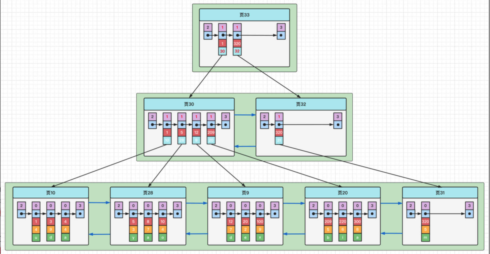

#### 1. 在说索引前，先了解下什么是存储引擎？
概念：
1. 简单点说就是表的类型；
2. 不同存储引擎在底层文件的存储上有差异

mysql常见存储引擎：
1. InnoDB: 支持外键、支持事务
2. MyISAM: 不支持事务，优点：拥有较高的插入、查询速度
> PS: 由于在真实业务环境中，大多要求支持事务，所以基本上我们说的默认存储引擎是innodb

#### 2. 什么是索引？
索引就是排好序的数据结构
> ps: 由于是排好序的所以大大加快了查询速度

#### 3. 索引分类？
1. 从数据结构上划分：B+数索引、Hash索引
2. 从逻辑上有：单列（普通）索引、组合（复合）索引、唯一索引、聚集（主键）索引、非聚集索引（二级索引）
    - 复合索引：也就是多个列组合成的索引，使用时候一般按照字段的使用频率排序，使用多的排在最左侧
    - 聚集索引：也就是主键构成的索引
    - 非聚集索引：是相对于聚集索引而言的，使用时候先根据非聚集索引查出主键，再根据主键查出具体数据
  
#### 4. 如何建立索引
1. 一般而言，我们是对常用过滤(where)、分组（group by) 、排序(order)上建立索引
2. 组合索引优于单列索引（使用概率高的排左侧）
3. 尽量对区分度高的列使用索引（比如：性别就不适合建立索引）

#### 5. B+树数据结构
b+树索引是一种常用的索引存储方式，非常普遍；默认情况下，我们讨论索引指的是B+树索引，我们必须了解B+树索引的结构

##### 1. 认识B+树结构

为了认识上面图，需要了解一些基础的东西：
1. 页：每个小方块就是一个页，也就是一组索引相关数据；
   每个页中首行是record_type: 2最小记录（左）、3最大记录、1目录项、0、普通记录
2. 数据页：最底层的叶子结点
   一般存储的是索引字段值、主键值（上图-聚集索引：主键值和所有列字段值）
3. 目录页：非叶子结点都是目录页
   每个目录项内存储的是，索引值(上图：主键值）和页号
4. 链表：无论每个页内数据项之间，页与页之间都是通过链表连接
5. 有序：页与页之间、数据项之间，都是按照顺序排列

##### 2. 索引如何查找？ 
大体分为两步骤：
1. 根据二分查找，找到对应的目录项，在目录项中找到叶子结点所在页号
2. 找到叶子结点所在页，找到叶子结点所在索引项，如果是聚集索引——数据直接捞出；如果非聚集索引（二级索引）找到主键id后，进行回表找到具体数据

##### 3. 补充知识
1. 一个页大小为16KB，因此可存储的数据项是有限的
2. B+树层级一般不会超过4层，因为数据量已经很大；
> 我们假设，每个叶子结点可以存储100条数据,每个目录项可以存储1000条记录；则1000 * 1000 * 1000 * 100 = 100亿已经非常大了

